# `zengin4j` — Build Specification

**An open-source JVM library for the Japanese Zengin (全銀) bank file formats, with bidirectional ISO 20022 mapping.**

| | |
|---|---|
| **Document type** | Implementation specification / build brief |
| **Version** | 1.0 |
| **Intended reader** | An engineer or autonomous coding agent implementing the project from scratch |
| **Target license** | Apache License 2.0 |
| **Language / baseline** | Java 21 |
| **Build system** | Gradle (Kotlin DSL) |
| **Working name** | `zengin4j` — see §32 Q1 if a rename is desired |

---

# Part 0 — Instructions for the implementing agent

Read this part completely before writing any code. It governs everything that follows.

## 0.1 What this document is

A complete specification for a Java library that reads and writes Japanese fixed-length bank payment
files and converts them to and from ISO 20022 XML messages. It contains requirements (`R-xx`), class
and sequence designs, algorithms, a worked byte-level example, a test strategy and a phased work
breakdown.

The document is self-contained. All domain terminology is defined in §1. No external context is
assumed.

## 0.2 The single most important rule

> **NEVER INVENT FORMAT DATA.**
>
> This specification describes byte-level record layouts for financial file formats. Some field
> definitions are marked **`[VERIFY]`**, meaning they are believed correct but have not been
> confirmed against an authoritative source. Some are absent entirely.
>
> When a field layout, byte offset, code-list value or mapping target is not stated in this document,
> **do not guess it, do not infer it from a similar format, and do not synthesise a plausible value.**
> A wrong byte offset in a payment file produces silently corrupted financial instructions.
>
> Instead: implement the surrounding machinery, mark the descriptor `verified: false`, and make the
> library **fail loudly** when an unverified descriptor is used in strict mode.

This rule exists because a fixed-length payment format is a domain where confident-sounding wrong
answers are worse than admitted gaps. A missing format is an open ticket. A fabricated format is a
production incident at whoever adopts the library.

## 0.3 The `[VERIFY]` protocol

Every format descriptor carries a `verified` boolean and a `sources` list.

| State | Meaning | Behaviour |
|---|---|---|
| `verified: true` with ≥ 2 independent sources cited | Layout confirmed | Loadable in all modes |
| `verified: false` | Layout provisional or partially derived from this document alone | Loadable only when `ReaderOptions.allowUnverifiedFormats(true)`; emits a startup warning; generated docs carry a visible banner |
| Absent | Not implemented | `UnsupportedFormatException` naming the 種別コード |

**R-0.1** — The `verified` flag defaults to `false`. Setting it to `true` requires at least two
independent cited sources in `docs/SOURCES.md`.

**R-0.2** — Where two sources disagree on a field, record both readings in `docs/DISCREPANCIES.md`
with citations, implement the more conservative reading, and keep `verified: false` until resolved.

**R-0.3** — The formats given in §14.1 of this document are provided as **working drafts to build
machinery against**. Ship them as `verified: false` unless and until independently confirmed.

## 0.4 Explicit prohibitions

| # | Prohibition | Reason |
|---|---|---|
| **P1** | Do not commit real or realistic-looking payment data, account numbers, or bank identifiers outside published test ranges | This is a payments library; a leaked-looking fixture is a liability |
| **P2** | Do not copy specification text, tables or diagrams from 全銀協 or bank publications into the repository | Those documents are not openly licensed. Field *names, lengths and types* are functional facts and may be encoded in descriptors; explanatory prose must be original |
| **P3** | Do not add runtime dependencies to `zengin4j-core` | See R-M1. This is the property that makes the library adoptable in regulated environments |
| **P4** | Do not build a kanji-reading dictionary or attempt kanji→kana transliteration | Readings are ambiguous; a wrong reading on a beneficiary name misroutes funds. Reject instead (R-K6) |
| **P5** | Do not silently truncate, coerce, or default any value during conversion | Every lossy operation must produce a `LossEntry` (R-I14) |
| **P6** | Do not implement `pacs.*` messages | Out of scope; see §16.1 for why |
| **P7** | Do not implement network transport of any kind | This is a codec. Files in, files out (NG1) |
| **P8** | Do not upgrade the pinned ISO 20022 message versions | The profile pins `pain.001.001.03`. Newer is not better here (R-I3) |
| **P9** | Do not publish a performance number that has not been measured under stated conditions | R-P4 |
| **P10** | Do not use `String` length arithmetic anywhere in the codec | All lengths are byte counts (R-C15) |

## 0.5 Build order

Implement in this sequence. Each epic has a milestone that must pass before the next begins.
Full breakdown in §28.

```
Epic 1  Walking skeleton         → parse one synthetic file end to end
Epic 2  Writer + round-trip      → INV-1 (byte-exact round trip) green
Epic 3  Charset + 120-byte set   → first release candidate
Epic 4  Validation               → structured findings, SARIF output
Epic 5  CLI                      → validate / inspect / generate
Epic 6  Transliteration engine   → dakuten-safe truncation
Epic 7  ISO 20022 subset         → pain.001 both directions with loss reporting
Epic 8  Extensions               → inbound messages, experimental mappings, 200-byte formats
```

**R-0.4** — Do not begin Epic 7 before Epic 6 is complete. The mapping layer depends on the
transliteration engine, and building it against a stub produces a design that is wrong in ways that
are expensive to unwind.

**R-0.5** — Do not attempt Epics 3–8 in parallel. Each depends on interfaces stabilised by the
previous one.

## 0.6 When uncertain

| Situation | Correct action | Incorrect action |
|---|---|---|
| A field's byte offset is not stated | Leave the format `verified: false`, implement the machinery, add a `[VERIFY]` note in the descriptor | Compute a plausible offset from adjacent fields |
| A code-list value is unknown | Model the field as a raw value with an open enum, add a `V-2xx` rule that is disabled by default | Invent enum constants |
| An ISO 20022 target path is unclear | Mark the mapping rule `verified: false`, exclude it from the conformance claim | Pick the path that "looks right" |
| A requirement in this document is ambiguous | Implement the more conservative reading and record an ADR explaining the interpretation | Pick the easier reading silently |
| Two requirements appear to conflict | Record it as an open question in `docs/OPEN_QUESTIONS.md` and implement the safer behaviour | Resolve it by dropping one |

**R-0.6** — Every interpretation decision made while implementing must produce an ADR in
`docs/adr/`. An implementation that makes twenty undocumented judgement calls is not reviewable.

## 0.7 Coding conventions

| # | Convention |
|---|---|
| **R-0.7** | Java 21. Records, sealed interfaces, pattern matching for `switch`, text blocks. No preview features. |
| **R-0.8** | No `null` in public API returns. Use `Optional` for absent values, empty collections for absent collections. |
| **R-0.9** | No checked exceptions in public API. All exceptions extend `ZenginException extends RuntimeException` (§18). |
| **R-0.10** | No static mutable state. No lazy singletons. Registries are constructed and injected. |
| **R-0.11** | Immutability by default. No setters on any public type. |
| **R-0.12** | Every public type and method carries Javadoc with `@since`. |
| **R-0.13** | Generated code lives in a `generated` package, is committed, is annotated `@Generated`, and is never hand-edited. |
| **R-0.14** | Package-private and private members are preferred; expose the minimum surface. |
| **R-0.15** | Field constants (byte values, ranges, lengths) are named, never inline magic numbers. |

---

# Part I — Context

## 1. Glossary

Self-contained. All domain terminology used in this document is defined here.

### 1.1 Institutions and systems

| Term | Reading | Meaning |
|---|---|---|
| **全国銀行協会 / 全銀協** | Zenginkyō | Japanese Bankers Association. Defines the record formats this library implements. "全銀協規定形式" = "JBA-prescribed format". |
| **全銀ネット** | Zengin-Net | Japanese Banks' Payment Clearing Network. Operates the clearing systems below. |
| **全銀システム** | Zengin System | Domestic interbank clearing for yen transfers. Nearly every deposit-taking institution in Japan connects to it. |
| **第7次全銀システム** | dai-nana-ji | The 7th-generation system, currently live. Replacement deadline November 2027; build vendor selected September 2023. |
| **全銀EDIシステム / ZEDI** | Zengin EDI System | Allows companies to send transfer instructions as **ISO 20022 XML** and attach commercial data. **ZEDI converts the XML to fixed-length before forwarding to the originating bank** — this conversion is the problem this library solves. |
| **テレ為替** | tele-kawase | The interbank leg of 全銀システム. Proprietary fixed-length telegrams, *not* ISO 20022. |
| **外国為替円決済制度 / FXYCS** | — | Cross-border yen clearing. Migrated to ISO 20022 in November 2025. Out of scope. |
| **日銀ネット** | Nichigin-Net | BOJ-NET, the central bank RTGS system. Out of scope. |

### 1.2 Payment products (the formats implemented)

| Term | Reading | Meaning | 種別コード |
|---|---|---|---|
| **総合振込** | sōgō furikomi | Bulk credit transfer — one file, many payees. The flagship format. | `21` |
| **給与振込** | kyūyo furikomi | Payroll transfer. Near-identical to 総合振込 with fields repurposed. | `11` |
| **賞与振込** | shōyo furikomi | Bonus transfer. | `12` |
| **預金口座振替** | yokin kōza furikae | Direct debit. Functionally analogous to SEPA Direct Debit, but with **no mandate messaging layer** — mandates are handled entirely out of band. | `91` |
| **口座振替結果** | — | Direct debit result file. Same records with a result code populated. Role-equivalent to SEPA R-transactions, but delivered as a batch result file rather than per-message. | `91` |
| **振込入金通知** | furikomi nyūkin tsūchi | Credit notification. **200-byte records.** | `[VERIFY]` |
| **入出金取引明細** | nyūshukkin torihiki meisai | Account transaction statement. Also 200-byte. | `[VERIFY]` |

### 1.3 Format and encoding terms

| Term | Meaning |
|---|---|
| **全銀フォーマット** | The fixed-length record format. Also written 全銀協規定形式, 全銀形式. |
| **データ区分** | Record-type discriminator, first byte of every record: `1` header, `2` data, `8` trailer, `9` end. |
| **種別コード** | Business-type code (table above), bytes 2–3 of the header record. |
| **コード区分** | Character-encoding indicator: `0` JIS, `1` EBCDIC. |
| **仕向 / 被仕向** | shimuke / hishimuke — originating side / receiving side. |
| **委託者 / 依頼人** | itakusha / irainin — the entrusting party; the company sending the instruction. Maps to `InitiatingParty` / `Debtor`. |
| **受取人** | uketorinin — beneficiary. Maps to `Creditor`. |
| **半角カナ** | Half-width katakana. Single-byte katakana (`ﾀ` `ﾅ` `ｶ`) rather than full-width (`タ` `ナ` `カ`). All name fields are half-width katakana only. |
| **濁点 / 半濁点** | dakuten / handakuten — voicing marks. In half-width encoding these are **separate characters**: `ｶﾞ` (ga) occupies two bytes. Central to §17. |
| **Shift-JIS / CP932** | Legacy Japanese encoding. CP932 is Microsoft's superset with NEC/IBM extensions. Half-width katakana occupies the single-byte range `0xA1`–`0xDF`. |
| **N field / C field** | `N` (ゾーン10進数, zoned decimal) = digits, right-aligned, zero-padded on the left. `C` = half-width katakana + uppercase Latin + digits, left-aligned, space-padded on the right. |
| **桁 / バイト** | keta / byte — used interchangeably in the source specifications because every permitted character is exactly one byte. **All lengths in this library are byte counts.** |
| **金融EDI情報 / 商流情報** | Financial EDI information / commercial flow information — invoice numbers, purchase order references attached to a payment. ZEDI's core value proposition. |

### 1.4 ISO 20022 terms

| Term | Meaning |
|---|---|
| **ISO 20022** | International financial messaging standard: a data dictionary plus an XML message catalogue. Progressively replacing legacy SWIFT MT messages worldwide. |
| **MT / MX** | MT = legacy SWIFT format. MX = the ISO 20022 XML replacement. |
| **Message identifier** | `family.number.variant.version` — e.g. `pain.001.001.03`. |
| **`pain`** | **Pay**ment **In**itiation — **customer-to-bank** messages. `pain.001` credit transfer initiation, `pain.002` status report, `pain.008` direct debit initiation. |
| **`pacs`** | **Pa**yments **C**learing and **S**ettlement — **bank-to-bank** messages. Not used in this project; see §16.1. |
| **`camt`** | **Ca**sh **M**anagemen**t** — bank-to-customer reporting. `camt.052` account report, `camt.053` statement, `camt.054` debit/credit notification. |
| **`head.001`** | Business Application Header (BAH) — envelope identifying sender, receiver, message type and creation time. |
| **Usage guideline / profile** | A scheme's restriction of a base message: pinned version, tightened optionality, constrained code lists. The ZEDI `pain.001` profile is one. |
| **`EndToEndId`** | A reference supplied by the initiating party, carried unchanged through the whole payment chain. The primary reconciliation handle. |
| **Lossy mapping** | A conversion where the target format cannot represent everything in the source. Central concept; see §16.8. |

---

## 2. Background and problem statement

Japan is in a long, partial transition from proprietary fixed-length payment files to ISO 20022 XML.

- Cross-border yen clearing finished migrating in November 2025.
- Corporate-to-bank has an ISO 20022 path via ZEDI (live since December 2018), but adoption is
  incomplete and the fixed-length format remains dominant in practice.
- Domestic interbank clearing has not migrated. The 2027 system replacement is the next inflection
  point.

Critically, **ZEDI does not eliminate the fixed-length format — it converts to it.** ZEDI accepts XML
from the company and hands fixed-length records to the originating bank. The fixed-length ↔ ISO 20022
mapping is therefore not a one-off migration exercise but a permanent bridging requirement, currently
implemented privately and inconsistently by every participant.

### 2.1 Existing open-source landscape

| Project | Language | Coverage | Gap |
|---|---|---|---|
| `Kyash/zengin-go` | Go | Parsing, Shift-JIS/UTF-8, streaming iterator | Parse only, no ISO 20022 |
| `diva-osaka/Diva.Zengin` | C# | Read/write Zengin + CSV | No ISO 20022 |
| `devture/zengin-generator` | PHP | Generation only, early development | Not production-ready |
| `zengin-code/*` | Multiple | Bank/branch **reference data** only | Not a format library |

No existing project in any language performs the ISO 20022 mapping, and none exists on the JVM. That
combination defines this project's scope.

---

## 3. Goals, non-goals, success criteria

### 3.1 Goals

| # | Goal |
|---|---|
| **G1** | Correct, byte-exact reading and writing of the major 全銀協規定形式 record formats |
| **G2** | Structured validation with byte-level error locations, usable as a pre-submission gate |
| **G3** | Bidirectional mapping to the ISO 20022 messages in the ZEDI profile, with machine-readable reporting of everything lost in translation |
| **G4** | A correct, documented half-width katakana transliteration and truncation engine |
| **G5** | Streaming-capable, ergonomic API suitable for both batch tooling and service integration |
| **G6** | Production-quality bilingual (English / Japanese) documentation |

### 3.2 Non-goals

| # | Non-goal | Rationale |
|---|---|---|
| **NG1** | Network transport (全銀手順, JX手順, SFTP, bank APIs) | This is a codec. Files in, files out |
| **NG2** | `pacs.*` messages, CBPR+, FXYCS, BOJ-NET | Different systems, no published domestic profile, served by commercial tooling |
| **NG3** | テレ為替 interbank telegrams | No published profile to build against |
| **NG4** | GUI application | CLI plus an optional static playground |
| **NG5** | Bank connectivity | This library never opens a network socket |
| **NG6** | Kanji→kana transliteration | Ambiguous readings; see P4 |

### 3.3 Success criteria (all machine-verifiable)

| # | Criterion | Verification |
|---|---|---|
| **S1** | Round-trip fidelity | INV-1 property test green across the full conformance corpus |
| **S2** | Robustness | 1 hour of fuzzing with no undeclared exception, OOM, or hang |
| **S3** | Performance | ≥ 50 MB/s single-threaded parse, measured by the committed JMH harness |
| **S4** | Memory | Constant heap parsing a 1 GB file under a constrained-heap CI job |
| **S5** | Coverage | ≥ 90% line, ≥ 85% branch on `core`; ≥ 80% PIT mutation score on `core` and `iso20022` |
| **S6** | Conformance honesty | Every format descriptor and mapping rule carries a `verified` flag surfaced in generated docs; no rule claims conformance without ≥ 2 cited sources |
| **S7** | Portability | CI green on Linux, macOS and Windows |
| **S8** | Publishable | Artifacts build reproducibly, are signed, and carry a CycloneDX SBOM |

---

## 4. Use cases

| ID | Use case | Requires |
|---|---|---|
| **UC-1** | Pre-submission validation — catch character-set violations, trailer mismatches and non-business-day value dates before a bank rejects the file | Reader + validator + readable report |
| **UC-2** | Ingestion of bank output (振込入金通知, 口座振替結果) into a downstream reconciliation pipeline | Reader + streaming + typed model |
| **UC-3** | An ISO 20022-native system needing a Zengin-speaking edge adapter | Full bidirectional mapping + loss report |
| **UC-4** | ZEDI file production — emit a valid `pain.001` + BAH from data held in fixed-length shape | Mapping + BAH construction + envelope framing |
| **UC-5** | Migration analysis — determine which fields will not survive conversion, before committing to a migration | `dryRun` returning a loss report only |
| **UC-6** | Test fixture generation for downstream payment services | Builder API + deterministic generator in testkit |

---

## 5. Repository policy

These apply from the first commit regardless of whether the repository is public.

| # | Requirement |
|---|---|
| **R-L1** | **No real payment data.** All fixtures synthetic; bank and branch codes drawn from public reference datasets or documented test ranges; all names invented. |
| **R-L2** | Do not copy specification text, tables or diagrams from 全銀協 or bank publications into the repository. Field names, lengths and types are functional facts and may be encoded in descriptors; all explanatory prose must be original. |
| **R-L3** | Maintain `docs/SOURCES.md` from day one, citing every document (institution, title, URL, retrieval date) used to derive each format definition. Reconstructing provenance retroactively is significantly more work than maintaining it. |
| **R-L4** | Maintain `docs/DISCREPANCIES.md` recording every case where published sources disagree, with citations and the implemented resolution. |
| **R-L5** | A CI check scanning commits for anything resembling real account identifiers. |
| **R-L6** | `README` carries a prominent disclaimer: this library is not certified by 全銀協, 全銀ネット or any financial institution; users are responsible for validating output against their own institution's specification before production use. |
| **R-L7** | No institutional logos, and no naming or wording that implies endorsement by any standards body or financial institution. |

---

# Part II — Architecture

## 6. Context and container view

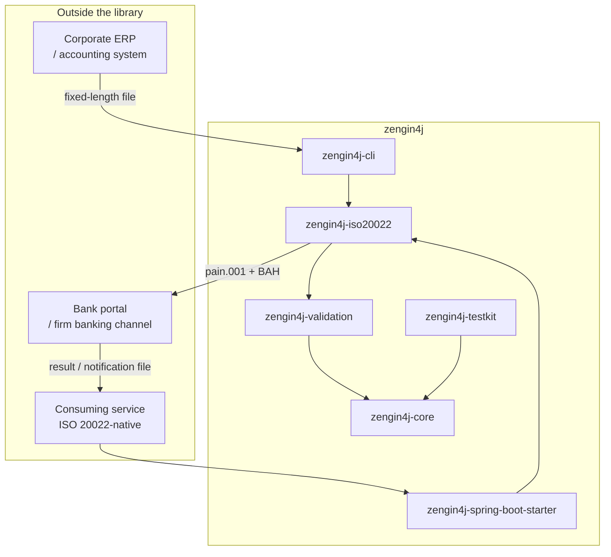
```mermaid
flowchart TB
    subgraph External["Outside the library"]
        ERP["Corporate ERP<br/>/ accounting system"]
        BankPortal["Bank portal<br/>/ firm banking channel"]
        Service["Consuming service<br/>ISO 20022-native"]
    end

    subgraph Lib["zengin4j"]
        CLI["zengin4j-cli"]
        Starter["zengin4j-spring-boot-starter"]
        Iso["zengin4j-iso20022"]
        Val["zengin4j-validation"]
        Core["zengin4j-core"]
        Kit["zengin4j-testkit"]
    end

    ERP -->|"fixed-length file"| CLI
    BankPortal -->|"result / notification file"| Service
    Service --> Starter
    CLI --> Iso
    Starter --> Iso
    Iso --> Val
    Val --> Core
    Kit --> Core
    Iso -->|"pain.001 + BAH"| BankPortal
```

## 7. Module graph and dependency rules

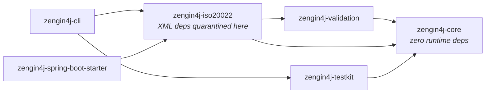
```mermaid
flowchart LR
    Core["zengin4j-core<br/><i>zero runtime deps</i>"]
    Val["zengin4j-validation"]
    Iso["zengin4j-iso20022<br/><i>XML deps quarantined here</i>"]
    Kit["zengin4j-testkit"]
    CLI["zengin4j-cli"]
    SB["zengin4j-spring-boot-starter"]

    Val --> Core
    Iso --> Val
    Iso --> Core
    Kit --> Core
    CLI --> Iso
    CLI --> Kit
    SB --> Iso
```

| # | Requirement |
|---|---|
| **R-M1** | `zengin4j-core` has **zero runtime dependencies**. No JSON library, no collections library, no logging facade. JDK only. This is the property that allows adoption in environments with dependency review processes. |
| **R-M2** | `zengin4j-validation` depends only on `core`. May bundle a business-calendar data file as a resource. |
| **R-M3** | `zengin4j-iso20022` is the **only** module permitted an XML dependency. All JAXB usage is confined here. |
| **R-M4** | `zengin4j-testkit` is a published artifact, not test-scoped — downstream consumers need it in their own tests. |
| **R-M5** | Dependency direction is **enforced in CI** (ArchUnit or Gradle module boundaries). A `core → validation` import fails the build. |
| **R-M6** | JPMS `module-info.java` for every module, plus `Automatic-Module-Name` in the manifest as fallback. |
| **R-M7** | Java 21 baseline throughout. |

## 8. Package structure

```
io.zengin4j                       ← replace with a group ID the publisher controls
├── core
│   ├── format          FormatDescriptor, RecordDescriptor, FieldDescriptor, FormatRegistry
│   ├── codec           ZenginReader, ZenginWriter, RecordFramer, RecordView, FieldCodec
│   ├── charset         ZenginCharset, CharacterClass, ByteRanges
│   ├── model           ZenginRecord + sealed subtypes, Batch, ZenginFile
│   │   └── generated   codegen output — committed, @Generated, never hand-edited
│   ├── time            MonthDayResolver, ResolutionStrategy
│   └── error           ZenginException hierarchy
├── validation
│   ├── api             Finding, Severity, ValidationReport, Rule, RuleScope
│   ├── engine          RuleEngine, RuleRegistry, ValidationContext
│   ├── rules           structural, syntax, consistency, reference, calendar, semantic
│   ├── calendar        BusinessCalendar, JapaneseBankCalendar
│   └── refdata         ReferenceDataProvider, ZenginCodeProvider
├── iso20022
│   ├── api             Iso20022Mapper, MappingContext, MappingResult, RoundTripResult
│   ├── loss            MappingLossReport  (LossEntry/Kind/Severity/Collector moved to core — ADR-0029)
│   ├── envelope        ZediEnvelopeReader, ZediEnvelopeWriter, BusinessApplicationHeader
│   ├── mapping         MappingRule, MappingRegistry, path resolution
│   ├── kana            (moved to core.kana in Epic 6 — R-C18 puts it on core's write path; ADR-0029)
│   ├── pain001 | pain002 | camt052 | camt054
│   └── experimental
│       └── pain008     口座振替 mapping — NON-STANDARD, this project's own design
├── testkit             Fixtures, ZenginGenerator, Assertions
└── cli                 Commands, output formatters
```

| # | Requirement |
|---|---|
| **R-M8** | `model.generated` is codegen output, committed so the repository is browsable without running the build, annotated `@Generated` so review tooling can skip it. |
| **R-M9** | `iso20022.experimental` is a hard boundary. Nothing outside it may claim conformance. Its public API carries an `@Experimental` annotation documented as subject to change in minor versions. |

## 9. Concurrency and threading model

| # | Requirement |
|---|---|
| **R-T1** | `FormatDescriptor`, `FormatRegistry`, `RuleRegistry`, `MappingRegistry` and `KanaTables` are **immutable and thread-safe**. Build once, share freely. |
| **R-T2** | `ZenginReader` and `ZenginWriter` are **stateful and not thread-safe**. One instance per thread. This must be stated on the type's Javadoc. |
| **R-T3** | `ZenginValidator` and `Iso20022Mapper` are **stateless and thread-safe**; all mutable state lives in per-call result objects. |
| **R-T4** | No static mutable state anywhere. No lazy singletons with double-checked locking. |
| **R-T5** | The library never spawns a thread. If a consumer wants parallelism they partition the input themselves. |
| **R-T6** | Parallel-friendly by construction: because records are fixed-length and self-describing after the header, a file can be split at record boundaries and processed in parallel by the caller. Document this pattern with a worked example rather than implementing it. |

## 10. Memory model and the zero-copy design

The performance target in §24 is achievable only if parsing does not allocate a `String` per field.
The design is a **lazy view over a recycled buffer**.

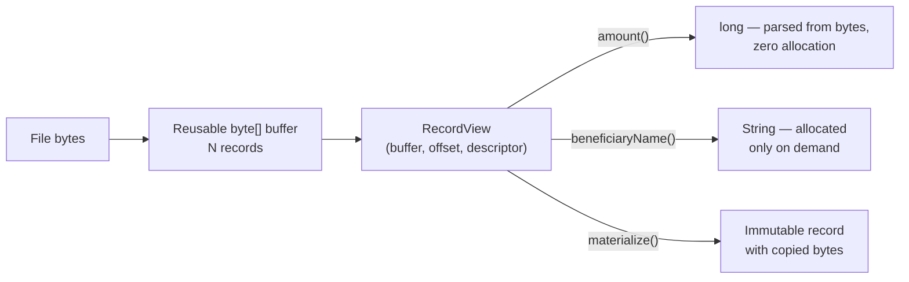
```mermaid
flowchart LR
    File["File bytes"] --> Buf["Reusable byte[] buffer<br/>N records"]
    Buf --> View["RecordView<br/>(buffer, offset, descriptor)"]
    View -->|"amount()"| Long["long — parsed from bytes,<br/>zero allocation"]
    View -->|"beneficiaryName()"| Str["String — allocated<br/>only on demand"]
    View -->|"materialize()"| Rec["Immutable record<br/>with copied bytes"]
```

| # | Requirement |
|---|---|
| **R-MEM1** | The reader owns a reusable buffer sized to a whole number of records (default 512 records, configurable). A `RecordView` is a `(byte[], offset, FormatDescriptor)` triple, never a copy. |
| **R-MEM2** | **The buffer is recycled.** A `RecordView` is valid only until `next()` is called again. This must appear in bold in the Javadoc, and `materialize()` must be provided for callers who need to retain a record. |
| **R-MEM3** | Numeric fields decode directly from bytes with no intermediate `String` — a hand-written digit loop, never `Integer.parseInt(new String(...))`. |
| **R-MEM4** | `String` fields allocate on access only, and cache within the view's lifetime. |
| **R-MEM5** | `BatchReader` materialises by default (safe); `ZenginReader` returns views by default (fast). Two APIs, two contracts, both documented. **The more convenient API defaults to the safer behaviour.** |
| **R-MEM6** | Memory is constant regardless of file size on the streaming path. Verified in CI by parsing a generated 1 GB file under a constrained heap. |

---

# Part III — Detailed design

## 11. Domain model

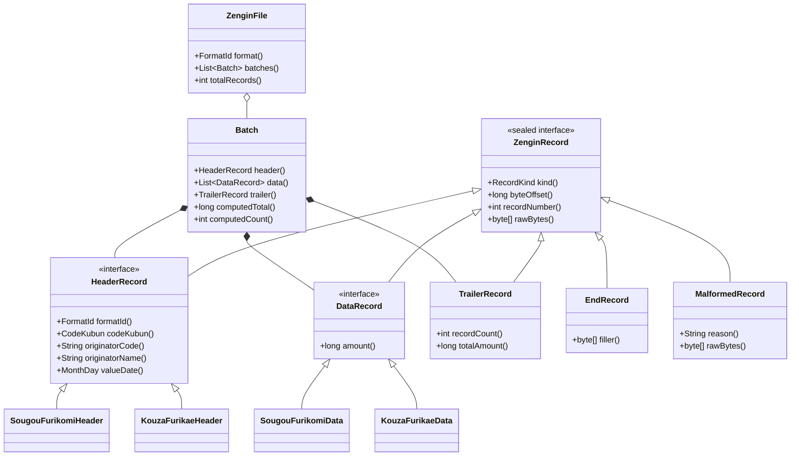
```mermaid
classDiagram
    class ZenginFile {
        +FormatId format()
        +List~Batch~ batches()
        +int totalRecords()
    }

    class Batch {
        +HeaderRecord header()
        +List~DataRecord~ data()
        +TrailerRecord trailer()
        +long computedTotal()
        +int computedCount()
    }

    class ZenginRecord {
        <<sealed interface>>
        +RecordKind kind()
        +long byteOffset()
        +int recordNumber()
        +byte[] rawBytes()
    }

    class HeaderRecord {
        <<interface>>
        +FormatId formatId()
        +CodeKubun codeKubun()
        +String originatorCode()
        +String originatorName()
        +MonthDay valueDate()
    }

    class DataRecord {
        <<interface>>
        +long amount()
    }

    class TrailerRecord {
        +int recordCount()
        +long totalAmount()
    }

    class EndRecord {
        +byte[] filler()
    }

    class MalformedRecord {
        +String reason()
        +byte[] rawBytes()
    }

    class SougouFurikomiHeader
    class SougouFurikomiData
    class KouzaFurikaeHeader
    class KouzaFurikaeData

    ZenginFile o-- Batch
    Batch *-- HeaderRecord
    Batch *-- DataRecord
    Batch *-- TrailerRecord
    ZenginRecord <|-- HeaderRecord
    ZenginRecord <|-- DataRecord
    ZenginRecord <|-- TrailerRecord
    ZenginRecord <|-- EndRecord
    ZenginRecord <|-- MalformedRecord
    HeaderRecord <|-- SougouFurikomiHeader
    HeaderRecord <|-- KouzaFurikaeHeader
    DataRecord <|-- SougouFurikomiData
    DataRecord <|-- KouzaFurikaeData
```

### 11.1 Design principles

| # | Requirement |
|---|---|
| **R-D1** | **The domain model is format-shaped, not idealised.** `SougouFurikomiHeader` has exactly the fields the header record has, in the order it has them. Do **not** build a "unified payment" abstraction in `core`. That abstraction belongs in the ISO 20022 layer where it is explicit and reversible. **This is the single most important structural decision in the library** — it is what makes round-tripping provable. |
| **R-D2** | Concrete records are immutable Java `record` types. Collections are unmodifiable. |
| **R-D3** | Hierarchies are `sealed`, enabling exhaustive `switch` without a default branch. |
| **R-D4** | Types are used where unambiguous and lossless (`long` for yen, `int` for codes, `MonthDay` for MMDD, enums for closed code lists); raw `String` where padding semantics must survive. |
| **R-D5** | Every record retains its **raw bytes**. Round-trip fidelity requires that unknown, reserved and filler bytes are preserved verbatim rather than regenerated. |
| **R-D6** | Amounts are `long` yen. The data field is `N(10)` = max ¥9,999,999,999; the trailer is `N(12)` = max ¥999,999,999,999. `BigDecimal` is inappropriate — there is no minor unit. |
| **R-D7** | Trailer-total overflow when summing is detected and reported as a validation finding, never silently wrapped. |
| **R-D8** | `MalformedRecord` is part of the sealed hierarchy, not an exception. A single bad record must not prevent the caller from seeing the other 9,999. |

### 11.2 Dates — the year inference problem

`振込指定日` and `引落日` are `N(4)` = `MMDD`. **There is no year component.**

| # | Requirement |
|---|---|
| **R-D9** | The parsed type is `java.time.MonthDay`, never `LocalDate`. The library never silently invents a year. |
| **R-D10** | Resolution is explicit and opt-in: `MonthDayResolver.forwardLooking(reference).resolve(monthDay)`. |
| **R-D11** | Provide at least `FORWARD_LOOKING` (next occurrence at or after the reference date) and `NEAREST` (minimum absolute distance across year−1 / year / year+1). Document the December–January boundary hazard prominently. |
| **R-D12** | `0229` in a non-leap candidate year is reported explicitly, never surfaced as a raw `DateTimeException`. |

## 12. Codec layer

### 12.1 Class design

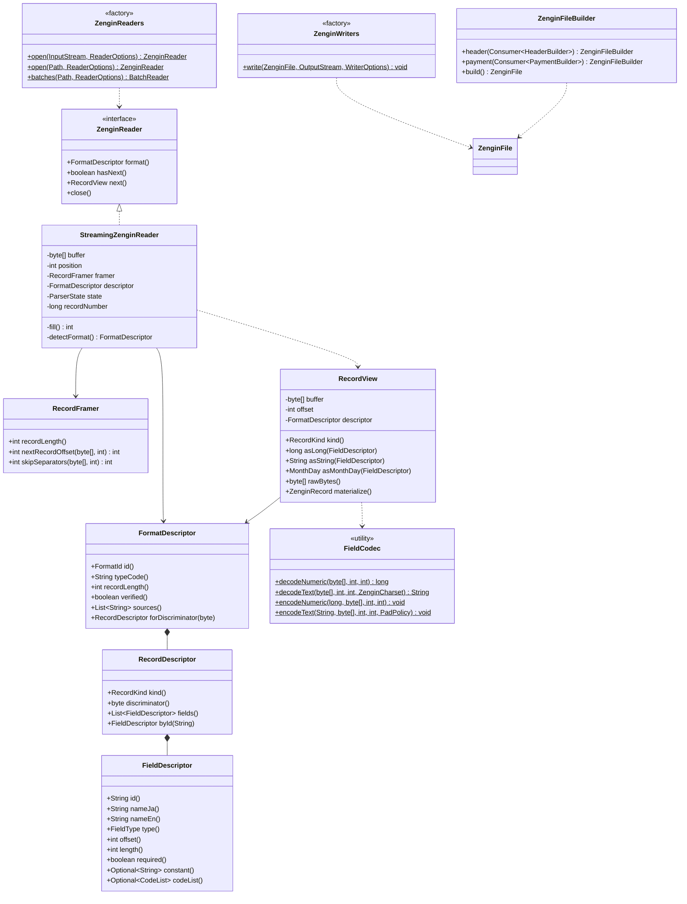
```mermaid
classDiagram
    class ZenginReaders {
        <<factory>>
        +open(InputStream, ReaderOptions)$ ZenginReader
        +open(Path, ReaderOptions)$ ZenginReader
        +batches(Path, ReaderOptions)$ BatchReader
    }

    class ZenginReader {
        <<interface>>
        +FormatDescriptor format()
        +boolean hasNext()
        +RecordView next()
        +close()
    }

    class StreamingZenginReader {
        -byte[] buffer
        -int position
        -RecordFramer framer
        -FormatDescriptor descriptor
        -ParserState state
        -long recordNumber
        -fill() int
        -detectFormat() FormatDescriptor
    }

    class RecordFramer {
        +int recordLength()
        +int nextRecordOffset(byte[], int) int
        +int skipSeparators(byte[], int) int
    }

    class RecordView {
        -byte[] buffer
        -int offset
        -FormatDescriptor descriptor
        +RecordKind kind()
        +long asLong(FieldDescriptor)
        +String asString(FieldDescriptor)
        +MonthDay asMonthDay(FieldDescriptor)
        +byte[] rawBytes()
        +ZenginRecord materialize()
    }

    class FormatDescriptor {
        +FormatId id()
        +String typeCode()
        +int recordLength()
        +boolean verified()
        +List~String~ sources()
        +RecordDescriptor forDiscriminator(byte)
    }

    class RecordDescriptor {
        +RecordKind kind()
        +byte discriminator()
        +List~FieldDescriptor~ fields()
        +FieldDescriptor byId(String)
    }

    class FieldDescriptor {
        +String id()
        +String nameJa()
        +String nameEn()
        +FieldType type()
        +int offset()
        +int length()
        +boolean required()
        +Optional~String~ constant()
        +Optional~CodeList~ codeList()
    }

    class FieldCodec {
        <<utility>>
        +decodeNumeric(byte[], int, int)$ long
        +decodeText(byte[], int, int, ZenginCharset)$ String
        +encodeNumeric(long, byte[], int, int)$ void
        +encodeText(String, byte[], int, int, PadPolicy)$ void
    }

    class ZenginWriters {
        <<factory>>
        +write(ZenginFile, OutputStream, WriterOptions)$ void
    }

    class ZenginFileBuilder {
        +header(Consumer~HeaderBuilder~) ZenginFileBuilder
        +payment(Consumer~PaymentBuilder~) ZenginFileBuilder
        +build() ZenginFile
    }

    ZenginReaders ..> ZenginReader
    ZenginReader <|.. StreamingZenginReader
    StreamingZenginReader --> RecordFramer
    StreamingZenginReader --> FormatDescriptor
    StreamingZenginReader ..> RecordView
    RecordView --> FormatDescriptor
    RecordView ..> FieldCodec
    FormatDescriptor *-- RecordDescriptor
    RecordDescriptor *-- FieldDescriptor
    ZenginWriters ..> ZenginFile
    ZenginFileBuilder ..> ZenginFile
```

### 12.2 Reading — sequence

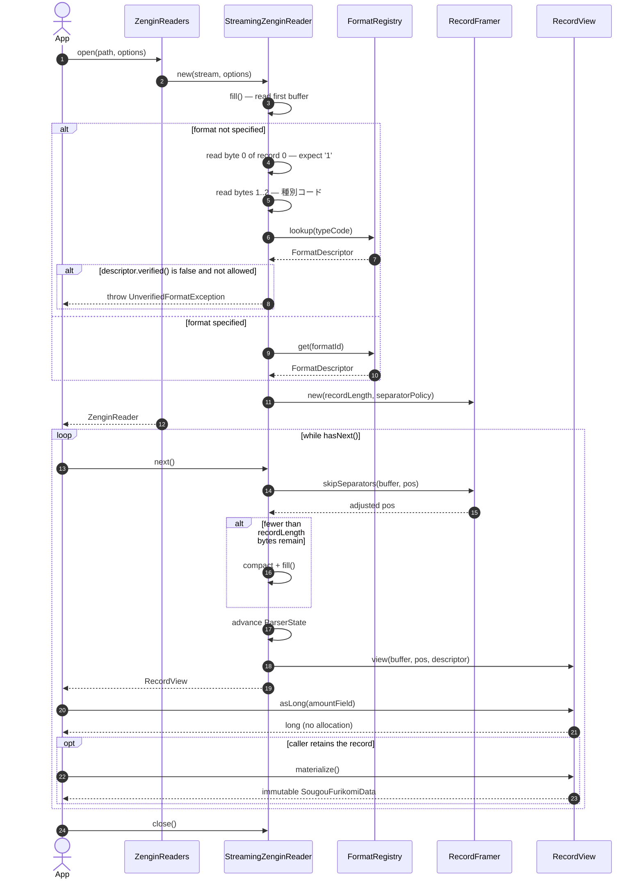
```mermaid
sequenceDiagram
    autonumber
    actor App
    participant RS as ZenginReaders
    participant R as StreamingZenginReader
    participant Reg as FormatRegistry
    participant F as RecordFramer
    participant V as RecordView

    App->>RS: open(path, options)
    RS->>R: new(stream, options)
    R->>R: fill() — read first buffer
    alt format not specified
        R->>R: read byte 0 of record 0 — expect '1'
        R->>R: read bytes 1..2 — 種別コード
        R->>Reg: lookup(typeCode)
        Reg-->>R: FormatDescriptor
        alt descriptor.verified() is false and not allowed
            R-->>App: throw UnverifiedFormatException
        end
    else format specified
        R->>Reg: get(formatId)
        Reg-->>R: FormatDescriptor
    end
    R->>F: new(recordLength, separatorPolicy)
    RS-->>App: ZenginReader

    loop while hasNext()
        App->>R: next()
        R->>F: skipSeparators(buffer, pos)
        F-->>R: adjusted pos
        alt fewer than recordLength bytes remain
            R->>R: compact + fill()
        end
        R->>R: advance ParserState
        R->>V: view(buffer, pos, descriptor)
        R-->>App: RecordView
        App->>V: asLong(amountField)
        V-->>App: long (no allocation)
        opt caller retains the record
            App->>V: materialize()
            V-->>App: immutable SougouFurikomiData
        end
    end
    App->>R: close()
```

### 12.3 Writing — sequence

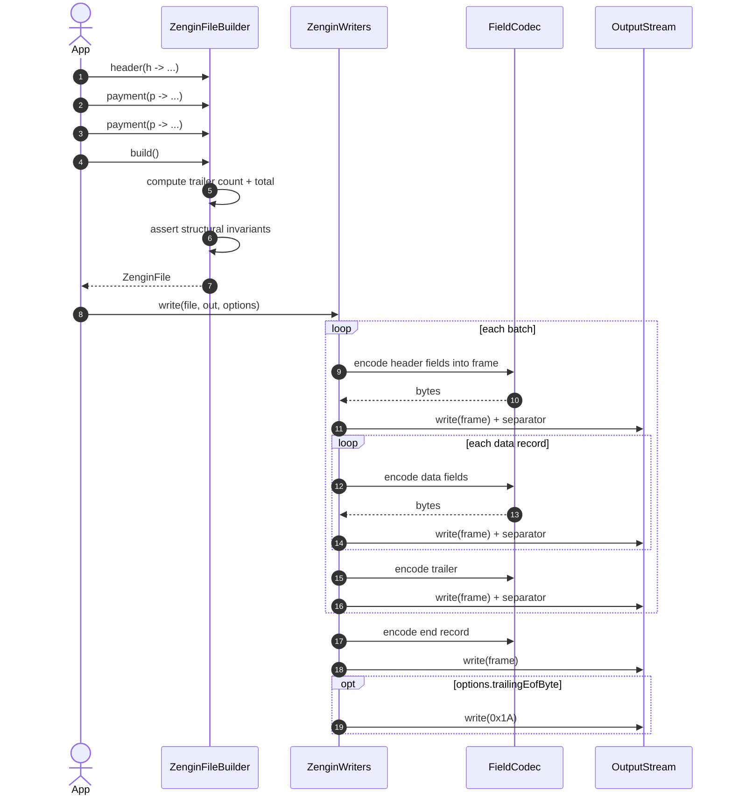
```mermaid
sequenceDiagram
    autonumber
    actor App
    participant B as ZenginFileBuilder
    participant W as ZenginWriters
    participant FC as FieldCodec
    participant Out as OutputStream

    App->>B: header(h -> ...)
    App->>B: payment(p -> ...)
    App->>B: payment(p -> ...)
    App->>B: build()
    B->>B: compute trailer count + total
    B->>B: assert structural invariants
    B-->>App: ZenginFile

    App->>W: write(file, out, options)
    loop each batch
        W->>FC: encode header fields into frame
        FC-->>W: bytes
        W->>Out: write(frame) + separator
        loop each data record
            W->>FC: encode data fields
            FC-->>W: bytes
            W->>Out: write(frame) + separator
        end
        W->>FC: encode trailer
        W->>Out: write(frame) + separator
    end
    W->>FC: encode end record
    W->>Out: write(frame)
    opt options.trailingEofByte
        W->>Out: write(0x1A)
    end
```

### 12.4 Parser state machine

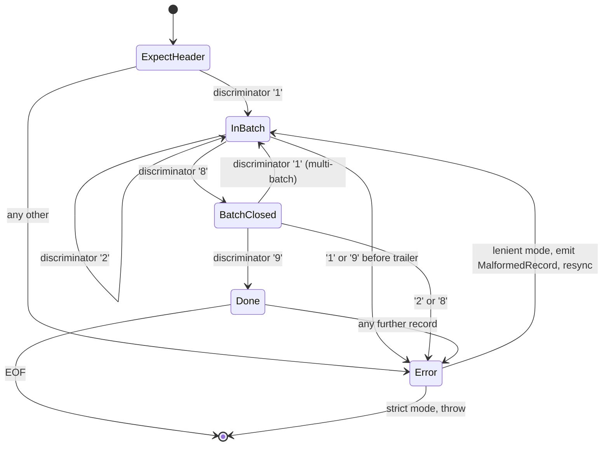
```mermaid
stateDiagram-v2
    [*] --> ExpectHeader
    ExpectHeader --> InBatch : discriminator '1'
    ExpectHeader --> Error : any other

    InBatch --> InBatch : discriminator '2'
    InBatch --> BatchClosed : discriminator '8'
    InBatch --> Error : '1' or '9' before trailer

    BatchClosed --> InBatch : discriminator '1' (multi-batch)
    BatchClosed --> Done : discriminator '9'
    BatchClosed --> Error : '2' or '8'

    Done --> Error : any further record
    Done --> [*] : EOF

    Error --> InBatch : lenient mode, emit MalformedRecord, resync
    Error --> [*] : strict mode, throw
```

| # | Requirement |
|---|---|
| **R-C1** | Support multiple header/data/trailer groups in one file, even where a specific institution forbids it. Enforce single-batch at the *validation* layer, not the parse layer. |
| **R-C2** | A missing end record is a **validation** finding, not a parse failure. Truncated files are common and users need diagnostics, not an exception. |
| **R-C3** | In lenient mode, `Error` resyncs by advancing one record length and emitting a `MalformedRecord`. Resync is by fixed offset, never by scanning for a discriminator byte — the offset is known. |

### 12.5 Record length is per-format

| Format | Record length |
|---|---|
| 総合振込 / 給与振込 / 賞与振込 | **120 bytes** |
| 預金口座振替 / 口座振替結果 | **120 bytes** |
| 振込入金通知 / 入出金取引明細 | **200 bytes** `[VERIFY]` |

| # | Requirement |
|---|---|
| **R-C4** | Record length is a property of `FormatDescriptor`. **There is no `RECORD_LENGTH` constant in the codebase.** |
| **R-C5** | Some institutions emit records longer than standard, space-padding the excess. Support a configurable `recordLength` override and a lenient mode that accepts over-length records and preserves trailing bytes. |

### 12.6 Framing and separators

| # | Requirement |
|---|---|
| **R-C6** | Separators between records are **optional**. Accept none, `CRLF`, `CR`, or `LF`, including inconsistently within one file. |
| **R-C7** | Separator bytes are **not** counted in record length. Detect and skip. |
| **R-C8** | Accept a trailing `EOF` byte `0x1A` after the end record. |
| **R-C9** | On write, separator style is configurable; default `CRLF`, `NONE` available. |
| **R-C10** | Detect a UTF-8 BOM at file start and either reject or strip with a warning. Never valid here, but appears in files from mis-configured tooling. |

### 12.7 Character encoding

| # | Requirement |
|---|---|
| **R-C11** | Charset options: `SHIFT_JIS`, `MS932`, `UTF_8`. **Default `MS932`** — it is what Windows-based Japanese accounting systems emit in practice. |
| **R-C12** | Document CP932 vs Shift_JIS divergence in `docs/encoding.md`, specifically the wave dash (`〜` U+301C vs `～` U+FF5E) and the NEC/IBM extension characters. |
| **R-C13** | Provide a `strict` mode rejecting any byte outside the permitted set. |
| **R-C14** | `コード区分` value `1` indicates **EBCDIC**. Detect it and fail with a named `UnsupportedEncodingVariantException` — never mis-decode as JIS. Full EBCDIC support is out of scope. |
| **R-C15** | All internal length arithmetic is in **bytes**. A `String.length()` check in the codec is a defect. |

### 12.8 Field types and padding

| Attribute | Content | Alignment | Pad byte | Value when omitted |
|---|---|---|---|---|
| **`N`** | ASCII digits `0`–`9` | Right | `0` (0x30) on the left | All zeros |
| **`C`** | Half-width katakana, uppercase `A`–`Z`, digits, limited symbols | Left | Space (0x20) on the right | All spaces |

| # | Requirement |
|---|---|
| **R-C16** | Permitted `C` set: half-width katakana `0xA1`–`0xDF`, uppercase `A`–`Z`, digits, space, and a symbol subset `[VERIFY per format]`. **Lowercase Latin is not permitted. Full-width characters are not permitted.** |
| **R-C17** | `CharacterSet.validate(byte[])` returns the byte offsets of every violation, not a boolean. |
| **R-C18** | On write, three policies for out-of-range input: `REJECT` (default), `TRANSLITERATE` (§17), `REPLACE` (substitute a configured byte and record the substitution). |
| **R-C19** | Writing is **deterministic** — identical input produces identical bytes, always. Required for golden-file testing. |

## 13. Format descriptors and the codegen pipeline

Field layouts are **data, not code**.

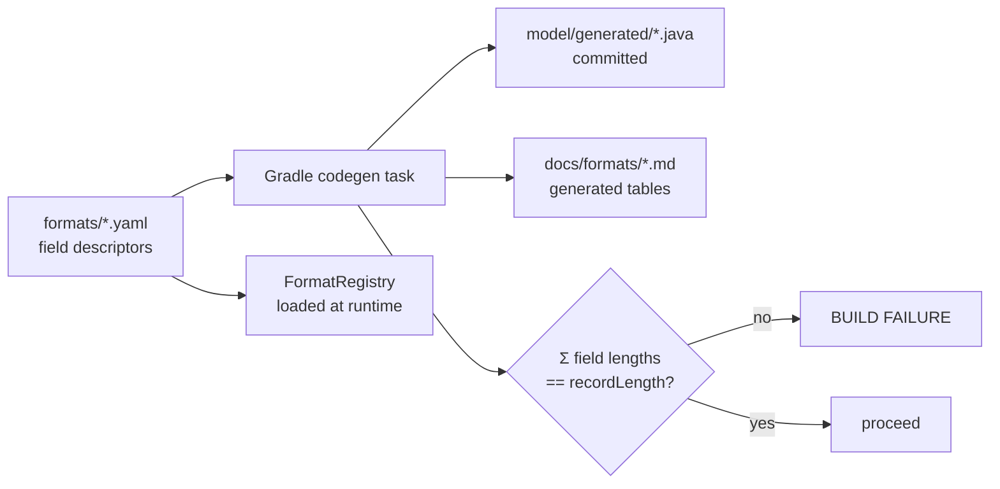
```mermaid
flowchart LR
    Yaml["formats/*.yaml<br/>field descriptors"] --> Gen["Gradle codegen task"]
    Gen --> Java["model/generated/*.java<br/>committed"]
    Gen --> Docs["docs/formats/*.md<br/>generated tables"]
    Gen --> Check{"Σ field lengths<br/>== recordLength?"}
    Check -->|no| Fail["BUILD FAILURE"]
    Check -->|yes| Ok["proceed"]
    Yaml --> Runtime["FormatRegistry<br/>loaded at runtime"]
```

```yaml
format:
  id: sougou-furikomi
  name-ja: 総合振込
  name-en: Bulk Credit Transfer
  type-code: "21"
  record-length: 120
  verified: false          # see R-0.1 — requires two independent cited sources to set true
  sources: []              # populate with institution, title, URL, retrieval date

  records:
    header:
      discriminator: "1"
      fields:
        - { seq: 1,  id: dataKubun,        ja: データ区分,   en: Record Type,      type: N, length: 1,  const: "1" }
        - { seq: 2,  id: typeCode,         ja: 種別コード,   en: Business Type,    type: N, length: 2,  const: "21" }
        - { seq: 3,  id: codeKubun,        ja: コード区分,   en: Character Code,   type: N, length: 1,  codelist: codeKubun }
        - { seq: 4,  id: originatorCode,   ja: 委託者コード, en: Originator Code,  type: N, length: 10, required: true }
        - { seq: 5,  id: originatorName,   ja: 委託者名,     en: Originator Name,  type: C, length: 40 }
        - { seq: 6,  id: valueDate,        ja: 振込指定日,   en: Value Date,       type: N, length: 4,  format: MMDD }
        - { seq: 7,  id: originBankCode,   ja: 仕向銀行番号, en: Origin Bank,      type: N, length: 4,  required: true }
        - { seq: 8,  id: originBankName,   ja: 仕向銀行名,   en: Origin Bank Name, type: C, length: 15 }
        - { seq: 9,  id: originBranchCode, ja: 仕向支店番号, en: Origin Branch,    type: N, length: 3,  required: true }
        - { seq: 10, id: originBranchName, ja: 仕向支店名,   en: Origin Branch Nm, type: C, length: 15 }
        - { seq: 11, id: accountType,      ja: 預金種目,     en: Account Type,     type: N, length: 1,  codelist: accountType }
        - { seq: 12, id: accountNumber,    ja: 口座番号,     en: Account Number,   type: N, length: 7 }
        - { seq: 13, id: filler,           ja: ダミー,       en: Filler,           type: C, length: 17, filler: true }
```

| # | Requirement |
|---|---|
| **R-F1** | A build-time validator asserts every record's field lengths sum exactly to `record-length`. This single check catches the majority of transcription errors. |
| **R-F2** | Field byte offsets are **computed from cumulative lengths, never written by hand.** Hand-written offsets are the single largest source of defects in fixed-length parsers. |
| **R-F3** | Generate typed record classes from descriptors via a Gradle source-generation task (not an annotation processor — simpler to debug, and output is committed). |
| **R-F4** | Generate reference documentation tables from the same descriptors, so documentation and code cannot drift. |
| **R-F5** | `verified` is surfaced in generated docs as a visible banner. |
| **R-F6** | Consumers can register their own descriptors at runtime for institution-specific variants (§19). |

### 13.1 Format catalogue — working drafts

> **Read §0.2 and §0.3 before using this section.** These layouts are working drafts provided so
> machinery can be built against a concrete shape. **Ship them `verified: false`.** Confirm each
> against at least two independent published sources before flipping the flag.

#### 総合振込 (`21`) — 120 bytes

*Header (データ区分 `1`)*

| # | Field | Type | Len | Offset |
|---|---|---|---|---|
| 1 | データ区分 | N | 1 | 0 |
| 2 | 種別コード | N | 2 | 1 |
| 3 | コード区分 | N | 1 | 3 |
| 4 | 委託者コード / 振込依頼人コード | N | 10 | 4 |
| 5 | 委託者名 / 振込依頼人名 | C | 40 | 14 |
| 6 | 振込指定日 (MMDD) | N | 4 | 54 |
| 7 | 仕向銀行番号 | N | 4 | 58 |
| 8 | 仕向銀行名 | C | 15 | 62 |
| 9 | 仕向支店番号 | N | 3 | 77 |
| 10 | 仕向支店名 | C | 15 | 80 |
| 11 | 預金種目 | N | 1 | 95 |
| 12 | 口座番号 | N | 7 | 96 |
| 13 | ダミー | C | 17 | 103 |

*Data (データ区分 `2`)*

| # | Field | Type | Len | Offset |
|---|---|---|---|---|
| 1 | データ区分 | N | 1 | 0 |
| 2 | 被仕向銀行番号 | N | 4 | 1 |
| 3 | 被仕向銀行名 | C | 15 | 5 |
| 4 | 被仕向支店番号 | N | 3 | 20 |
| 5 | 被仕向支店名 | C | 15 | 23 |
| 6 | 手形交換所番号 | N | 4 | 38 |
| 7 | 預金種目 | N | 1 | 42 |
| 8 | 口座番号 | N | 7 | 43 |
| 9 | 受取人名 | C | 30 | 50 |
| 10 | 振込金額 | N | 10 | 80 |
| 11 | 新規コード | N | 1 | 90 |
| 12 | 顧客コード1 | C | 10 | 91 |
| 13 | 顧客コード2 | C | 10 | 101 |
| 14 | 振込指定区分 | N | 1 | 111 |
| 15 | 識別表示 | C | 1 | 112 |
| 16 | ダミー | C | 7 | 113 |

*Trailer (`8`)*: 合計件数 `N(6)`, 合計金額 `N(12)`, ダミー `C(101)`.
*End (`9`)*: ダミー `C(119)`.

#### 給与振込 (`11`) / 賞与振込 (`12`) — 120 bytes

Structurally identical to 総合振込, with data-record fields 12–14 repurposed (社員番号 / 所属コード
in place of 顧客コード1/2). `[VERIFY]` — this is a commonly mis-implemented variant. **Do not derive
the repurposing from the 総合振込 layout; confirm it independently or ship the format unverified.**

#### 預金口座振替 (`91`) — 120 bytes

*Header*: データ区分 `N(1)`, 種別コード `N(2)` = `91`, コード区分 `N(1)`, 委託者コード `N(10)`,
委託者名 `C(40)`, **引落日** `N(4)` MMDD, 取引銀行番号 `N(4)`, 取引銀行名 `C(15)`,
取引支店番号 `N(3)`, 取引支店名 `C(15)`, 預金種目 `N(1)`, 口座番号 `N(7)`, ダミー `C(17)`.

> **Semantic inversion from 総合振込:** the institution named in the header is the **collection
> destination** (where funds land); the data records identify the **payers** being debited.
> Reversing this produces payments in the wrong direction. **Encode the direction explicitly in type
> and field names** (e.g. `collectionAccount` rather than reusing `originAccount`), so the two
> formats cannot be confused by a future maintainer.

#### 口座振替結果 (`91`, result variant) — 120 bytes

Same layout with **振替結果コード** populated. `[VERIFY]` the code list; it distinguishes collected /
insufficient funds / account not found / account closed / customer stop instruction / other. Model it
as a first-class enum with documented English glosses — this code list is the functional analogue of
SEPA R-transaction reason codes and is one of the most useful things the library can expose to an
English-speaking integrator.

#### 振込入金通知 / 入出金取引明細 — 200 bytes

Header carries 作成日, 勘定日(自), 勘定日(至) plus account identity. Data records carry 勘定日, 起算日,
取引金額, うち他店券金額, 振込依頼人コード, 振込依頼人名, 仕向銀行名, 仕向支店名, 取消区分 and an
**EDI情報** field. Trailer `N(6)` + `N(12)` + `C(181)`. `[VERIFY]` — the 200-byte formats vary more
between institutions than the 120-byte ones. **Defer to Epic 8.**

## 14. Validation layer

### 14.1 Class design

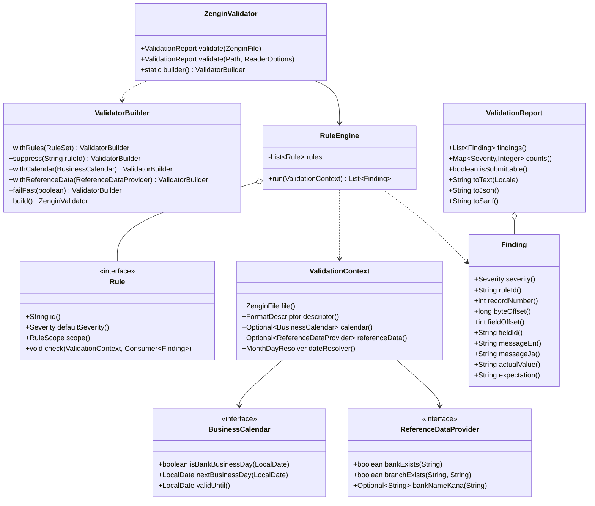
```mermaid
classDiagram
    class ZenginValidator {
        +ValidationReport validate(ZenginFile)
        +ValidationReport validate(Path, ReaderOptions)
        +static builder() ValidatorBuilder
    }

    class ValidatorBuilder {
        +withRules(RuleSet) ValidatorBuilder
        +suppress(String ruleId) ValidatorBuilder
        +withCalendar(BusinessCalendar) ValidatorBuilder
        +withReferenceData(ReferenceDataProvider) ValidatorBuilder
        +failFast(boolean) ValidatorBuilder
        +build() ZenginValidator
    }

    class RuleEngine {
        -List~Rule~ rules
        +run(ValidationContext) List~Finding~
    }

    class Rule {
        <<interface>>
        +String id()
        +Severity defaultSeverity()
        +RuleScope scope()
        +void check(ValidationContext, Consumer~Finding~)
    }

    class ValidationContext {
        +ZenginFile file()
        +FormatDescriptor descriptor()
        +Optional~BusinessCalendar~ calendar()
        +Optional~ReferenceDataProvider~ referenceData()
        +MonthDayResolver dateResolver()
    }

    class Finding {
        +Severity severity()
        +String ruleId()
        +int recordNumber()
        +long byteOffset()
        +int fieldOffset()
        +String fieldId()
        +String messageEn()
        +String messageJa()
        +String actualValue()
        +String expectation()
    }

    class ValidationReport {
        +List~Finding~ findings()
        +Map~Severity,Integer~ counts()
        +boolean isSubmittable()
        +String toText(Locale)
        +String toJson()
        +String toSarif()
    }

    class BusinessCalendar {
        <<interface>>
        +boolean isBankBusinessDay(LocalDate)
        +LocalDate nextBusinessDay(LocalDate)
        +LocalDate validUntil()
    }

    class ReferenceDataProvider {
        <<interface>>
        +boolean bankExists(String)
        +boolean branchExists(String, String)
        +Optional~String~ bankNameKana(String)
    }

    ZenginValidator --> RuleEngine
    ZenginValidator ..> ValidatorBuilder
    RuleEngine o-- Rule
    RuleEngine ..> ValidationContext
    RuleEngine ..> Finding
    ValidationReport o-- Finding
    ValidationContext --> BusinessCalendar
    ValidationContext --> ReferenceDataProvider
```

### 14.2 Validation — sequence

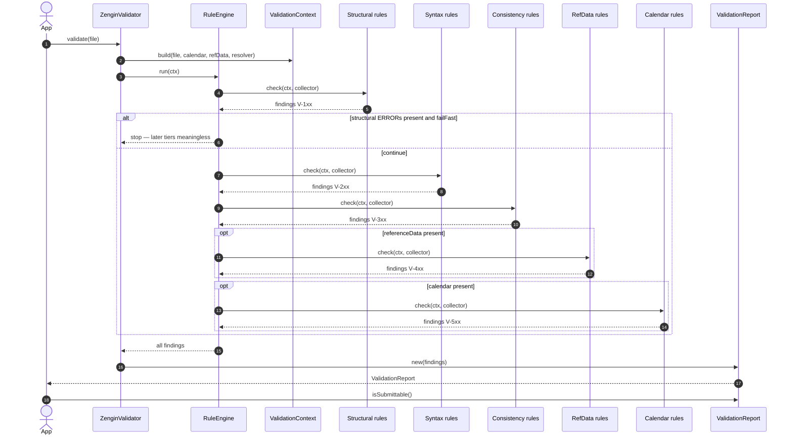
```mermaid
sequenceDiagram
    autonumber
    actor App
    participant V as ZenginValidator
    participant E as RuleEngine
    participant Ctx as ValidationContext
    participant R1 as Structural rules
    participant R2 as Syntax rules
    participant R3 as Consistency rules
    participant R4 as RefData rules
    participant R5 as Calendar rules
    participant Rep as ValidationReport

    App->>V: validate(file)
    V->>Ctx: build(file, calendar, refData, resolver)
    V->>E: run(ctx)
    E->>R1: check(ctx, collector)
    R1-->>E: findings V-1xx
    alt structural ERRORs present and failFast
        E-->>V: stop — later tiers meaningless
    else continue
        E->>R2: check(ctx, collector)
        R2-->>E: findings V-2xx
        E->>R3: check(ctx, collector)
        R3-->>E: findings V-3xx
        opt referenceData present
            E->>R4: check(ctx, collector)
            R4-->>E: findings V-4xx
        end
        opt calendar present
            E->>R5: check(ctx, collector)
            R5-->>E: findings V-5xx
        end
    end
    E-->>V: all findings
    V->>Rep: new(findings)
    Rep-->>App: ValidationReport
    App->>Rep: isSubmittable()
```

### 14.3 Philosophy and rule catalogue

| # | Requirement |
|---|---|
| **R-V1** | Validation **never throws**. It returns a report. Exceptions are for programmer error; malformed third-party files are expected input. |
| **R-V2** | Every finding carries severity, rule ID, byte offset, record number, field ID, both-language messages, the offending value, and the expected condition. |
| **R-V3** | Rules are individually addressable and suppressible by ID. Institutional practice varies; consumers must be able to disable a specific rule. |
| **R-V4** | The report serialises to JSON **and SARIF**. SARIF renders natively as CI annotations. |
| **R-V5** | Reference data is an **optional, pluggable** provider. The library works fully with it absent. Any bundled snapshot is versioned separately and its staleness risk documented. |
| **R-V6** | Ship a `BusinessCalendar` interface with a bundled Japanese implementation covering public holidays — **including the astronomically-determined moving holidays** (春分の日, 秋分の日), 振替休日 substitute holidays, and the year-end financial-institution closure period. |
| **R-V7** | The calendar declares `validUntil()` and fails loudly past its horizon rather than guessing. |

| Tier | ID range | Rules |
|---|---|---|
| **1 Structural** | `V-1xx` | Record length; valid データ区分 sequence; header precedes data; one trailer per header; end record present and last; nothing after end; file non-empty |
| **2 Field syntax** | `V-2xx` | Character-set conformance per field type; `N` contains digits only; `C` contains permitted bytes only; alignment and padding correct; constants hold their values; code-list membership; voicing-mark legality (R-K7) |
| **3 Consistency** | `V-3xx` | Trailer count equals actual count; trailer total equals sum; no arithmetic overflow; 種別コード consistent across headers; duplicate `(bank, branch, account, amount)` within a batch as **WARNING** — legal but usually a mistake |
| **4 Reference data** | `V-4xx` | Bank code exists; branch exists within that bank; both active at the value date where temporal data is available |
| **5 Calendar** | `V-5xx` | Value date is a financial-institution business day; not a weekend; not a public holiday; not in the year-end closure; within the accepted forward window |
| **6 Semantic warnings** | `V-6xx` | Name appears truncated mid-dakuten (§17); amount is zero; amount at field maximum; name field entirely padding; customer code fields unpopulated |

## 15. ISO 20022 layer

### 15.1 Which messages, and why not `pacs`

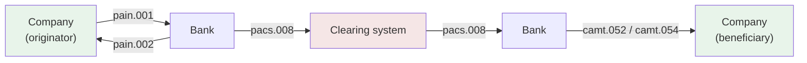
```mermaid
flowchart LR
    Co1["Company<br/>(originator)"] -->|"pain.001"| B1["Bank"]
    B1 -->|"pacs.008"| CS["Clearing system"]
    CS -->|"pacs.008"| B2["Bank"]
    B2 -->|"camt.052 / camt.054"| Co2["Company<br/>(beneficiary)"]
    B1 -->|"pain.002"| Co1

    style Co1 fill:#e8f4ea
    style Co2 fill:#e8f4ea
    style CS fill:#f5e6e6
```

The green boundary is **corporate↔bank** — `pain` and `camt`. That is where the Zengin corporate file
formats live, and it is the entire scope of this library.

The red box is **interbank** — `pacs`. In Japan the domestic interbank leg has not migrated to
ISO 20022 and has no published profile; the cross-border leg migrated in November 2025 but is a
different scheme served by commercial tooling. **`pacs` is out of scope entirely (P6).**

State this explicitly in the README — "where are the `pacs` messages?" is a predictable first question
from anyone with European payments background.

### 15.2 The ZEDI message set

| Message | Direction | Japanese product |
|---|---|---|
| `pain.001.001.03` | Company → system | 総合振込依頼 |
| `pain.002` | System → company | 総合振込結果 |
| `camt.052` | System → company | 入出金取引明細結果 |
| `camt.054` | System → company | 振込入金通知結果 |
| `head.001` | Both | Business Application Header |

| # | Requirement |
|---|---|
| **R-I1** | Implement exactly this set for the conformant layer. |
| **R-I2** | **The profile uses `camt.052`, not `camt.053`.** The account reporting message is the report, not the end-of-day statement. |
| **R-I3** | The version is **pinned to `pain.001.001.03`**. Do not upgrade (P8). Structure the code so additional versions can be added later without disturbing the pin. |
| **R-I4** | **There is no official ISO 20022 profile for 預金口座振替.** Any 口座振替 → `pain.008` mapping is a non-standard design belonging in `iso20022.experimental`, clearly marked in documentation, and excluded from every conformance claim. |

### 15.3 Class design

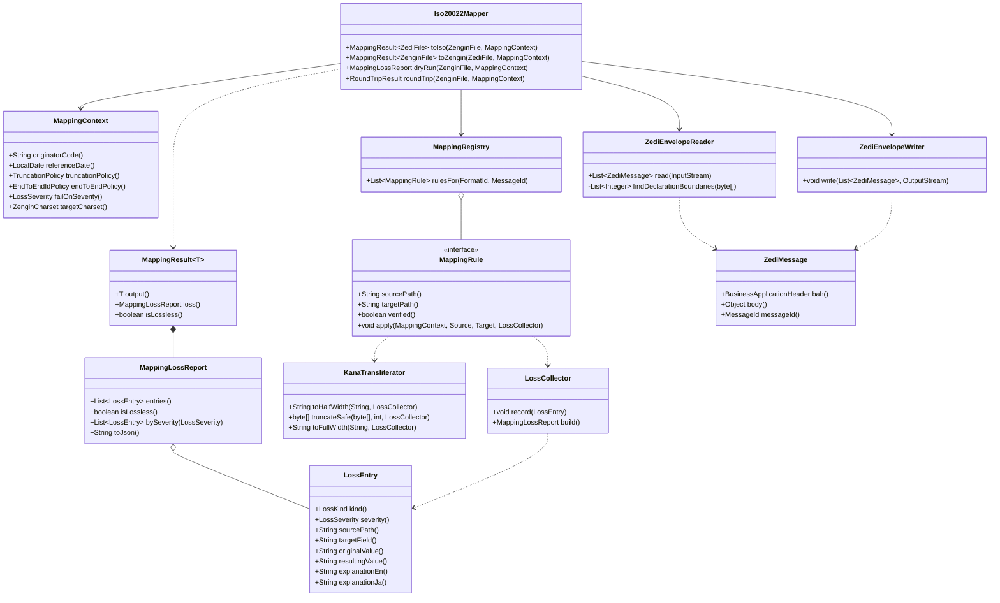
```mermaid
classDiagram
    class Iso20022Mapper {
        +MappingResult~ZediFile~ toIso(ZenginFile, MappingContext)
        +MappingResult~ZenginFile~ toZengin(ZediFile, MappingContext)
        +MappingLossReport dryRun(ZenginFile, MappingContext)
        +RoundTripResult roundTrip(ZenginFile, MappingContext)
    }

    class MappingContext {
        +String originatorCode()
        +LocalDate referenceDate()
        +TruncationPolicy truncationPolicy()
        +EndToEndIdPolicy endToEndPolicy()
        +LossSeverity failOnSeverity()
        +ZenginCharset targetCharset()
    }

    class MappingResult~T~ {
        +T output()
        +MappingLossReport loss()
        +boolean isLossless()
    }

    class MappingLossReport {
        +List~LossEntry~ entries()
        +boolean isLossless()
        +List~LossEntry~ bySeverity(LossSeverity)
        +String toJson()
    }

    class LossEntry {
        +LossKind kind()
        +LossSeverity severity()
        +String sourcePath()
        +String targetField()
        +String originalValue()
        +String resultingValue()
        +String explanationEn()
        +String explanationJa()
    }

    class MappingRule {
        <<interface>>
        +String sourcePath()
        +String targetPath()
        +boolean verified()
        +void apply(MappingContext, Source, Target, LossCollector)
    }

    class MappingRegistry {
        +List~MappingRule~ rulesFor(FormatId, MessageId)
    }

    class ZediEnvelopeReader {
        +List~ZediMessage~ read(InputStream)
        -List~Integer~ findDeclarationBoundaries(byte[])
    }

    class ZediEnvelopeWriter {
        +void write(List~ZediMessage~, OutputStream)
    }

    class ZediMessage {
        +BusinessApplicationHeader bah()
        +Object body()
        +MessageId messageId()
    }

    class KanaTransliterator {
        +String toHalfWidth(String, LossCollector)
        +byte[] truncateSafe(byte[], int, LossCollector)
        +String toFullWidth(String, LossCollector)
    }

    class LossCollector {
        +void record(LossEntry)
        +MappingLossReport build()
    }

    Iso20022Mapper --> MappingRegistry
    Iso20022Mapper --> MappingContext
    Iso20022Mapper ..> MappingResult
    Iso20022Mapper --> ZediEnvelopeReader
    Iso20022Mapper --> ZediEnvelopeWriter
    MappingRegistry o-- MappingRule
    MappingRule ..> LossCollector
    MappingRule ..> KanaTransliterator
    MappingResult *-- MappingLossReport
    MappingLossReport o-- LossEntry
    LossCollector ..> LossEntry
    ZediEnvelopeReader ..> ZediMessage
    ZediEnvelopeWriter ..> ZediMessage
```

### 15.4 Zengin → `pain.001` — sequence

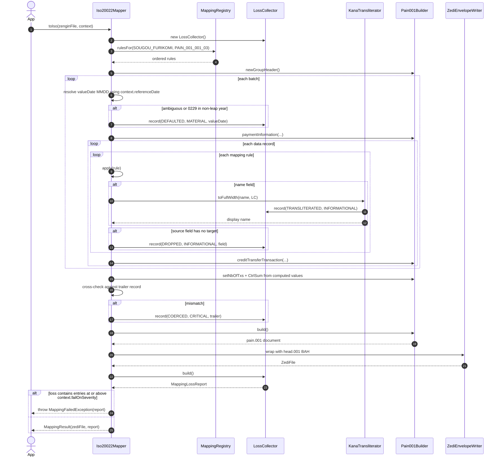
```mermaid
sequenceDiagram
    autonumber
    actor App
    participant M as Iso20022Mapper
    participant Reg as MappingRegistry
    participant LC as LossCollector
    participant KT as KanaTransliterator
    participant B as Pain001Builder
    participant EW as ZediEnvelopeWriter

    App->>M: toIso(zenginFile, context)
    M->>LC: new LossCollector()
    M->>Reg: rulesFor(SOUGOU_FURIKOMI, PAIN_001_001_03)
    Reg-->>M: ordered rules

    M->>B: newGroupHeader()
    loop each batch
        M->>M: resolve valueDate MMDD using context.referenceDate
        alt ambiguous or 0229 in non-leap year
            M->>LC: record(DEFAULTED, MATERIAL, valueDate)
        end
        M->>B: paymentInformation(...)
        loop each data record
            loop each mapping rule
                M->>M: apply(rule)
                alt name field
                    M->>KT: toFullWidth(name, LC)
                    KT->>LC: record(TRANSLITERATED, INFORMATIONAL)
                    KT-->>M: display name
                end
                alt source field has no target
                    M->>LC: record(DROPPED, INFORMATIONAL, field)
                end
            end
            M->>B: creditTransferTransaction(...)
        end
    end

    M->>B: setNbOfTxs + CtrlSum from computed values
    M->>M: cross-check against trailer record
    alt mismatch
        M->>LC: record(COERCED, CRITICAL, trailer)
    end
    M->>B: build()
    B-->>M: pain.001 document
    M->>EW: wrap with head.001 BAH
    EW-->>M: ZediFile
    M->>LC: build()
    LC-->>M: MappingLossReport
    alt loss contains entries at or above context.failOnSeverity
        M-->>App: throw MappingFailedException(report)
    else
        M-->>App: MappingResult(zediFile, report)
    end
```

### 15.5 `pain.001` → Zengin (inverse) — sequence

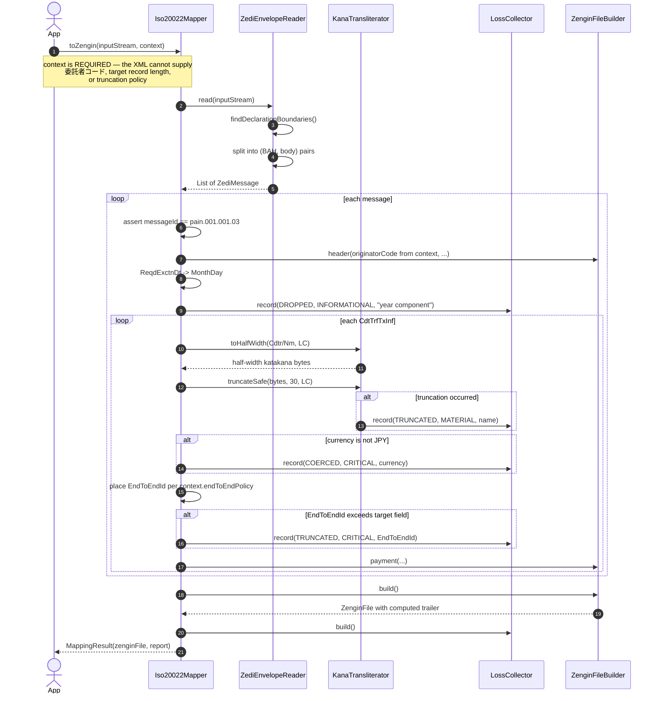
```mermaid
sequenceDiagram
    autonumber
    actor App
    participant M as Iso20022Mapper
    participant ER as ZediEnvelopeReader
    participant KT as KanaTransliterator
    participant LC as LossCollector
    participant FB as ZenginFileBuilder

    App->>M: toZengin(inputStream, context)
    Note over App,M: context is REQUIRED — the XML cannot supply<br/>委託者コード, target record length,<br/>or truncation policy
    M->>ER: read(inputStream)
    ER->>ER: findDeclarationBoundaries()
    ER->>ER: split into (BAH, body) pairs
    ER-->>M: List of ZediMessage

    loop each message
        M->>M: assert messageId == pain.001.001.03
        M->>FB: header(originatorCode from context, ...)
        M->>M: ReqdExctnDt -> MonthDay
        M->>LC: record(DROPPED, INFORMATIONAL, "year component")
        loop each CdtTrfTxInf
            M->>KT: toHalfWidth(Cdtr/Nm, LC)
            KT-->>M: half-width katakana bytes
            M->>KT: truncateSafe(bytes, 30, LC)
            alt truncation occurred
                KT->>LC: record(TRUNCATED, MATERIAL, name)
            end
            alt currency is not JPY
                M->>LC: record(COERCED, CRITICAL, currency)
            end
            M->>M: place EndToEndId per context.endToEndPolicy
            alt EndToEndId exceeds target field
                M->>LC: record(TRUNCATED, CRITICAL, EndToEndId)
            end
            M->>FB: payment(...)
        end
    end
    M->>FB: build()
    FB-->>M: ZenginFile with computed trailer
    M->>LC: build()
    M-->>App: MappingResult(zenginFile, report)
```

### 15.6 The BAH concatenation quirk

The profile concatenates the Business Application Header with the message body **at XML-declaration
granularity**, inserting CRLF after the BAH. The consequence:

> **A ZEDI file contains multiple XML declarations and is therefore not a single well-formed XML
> document.** Passing one to a standard XML parser fails immediately. Generic ISO 20022 libraries
> cannot read these files.

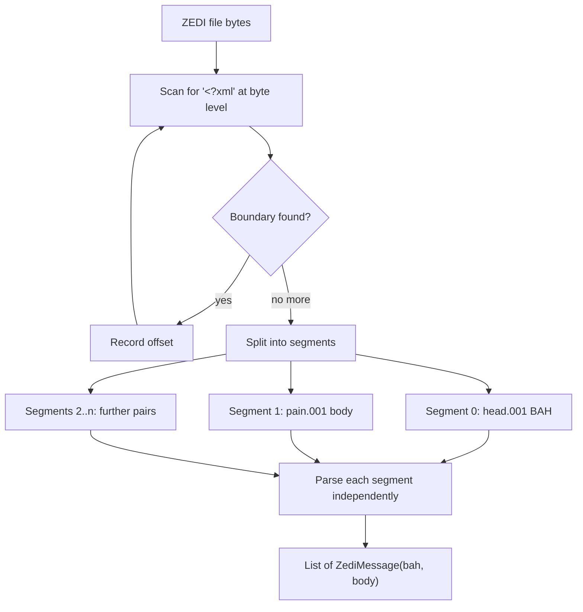
```mermaid
flowchart TD
    A["ZEDI file bytes"] --> B["Scan for '&lt;?xml' at byte level"]
    B --> C{"Boundary found?"}
    C -->|yes| D["Record offset"]
    D --> B
    C -->|no more| E["Split into segments"]
    E --> F["Segment 0: head.001 BAH"]
    E --> G["Segment 1: pain.001 body"]
    E --> H["Segments 2..n: further pairs"]
    F --> I["Parse each segment independently"]
    G --> I
    H --> I
    I --> J["List of ZediMessage(bah, body)"]
```

| # | Requirement |
|---|---|
| **R-I5** | `ZediEnvelopeReader` splits the byte stream on XML declaration boundaries, yielding `(BAH, body)` pairs, each independently parseable. |
| **R-I6** | The corresponding writer produces byte-identical framing, with CRLF placement matching the profile. |
| **R-I7** | Handle multiple message groups within one file. |
| **R-I8** | Splitting is provably safe against false positives: the base64 alphabet (`A–Z a–z 0–9 + / =`) does not include `<`, so a `<?xml` sequence cannot occur inside an encoded EDI payload. **Document this reasoning in the code and in an ADR.** |
| **R-I9** | Document the quirk in the README's first screen. It is the most concrete demonstrable reason the library exists. |

### 15.7 The 金融EDI payload

| # | Requirement |
|---|---|
| **R-I10** | In `pain.001` the EDI information is **base64-encoded per transaction detail**. Model it as a typed `EdiAttachment` carrying decoded bytes plus MIME metadata, not an opaque `String`. |
| **R-I11** | Provide accessors for both raw bytes and decoded text with an explicit charset. |
| **R-I12** | Round-trip must preserve the **exact** base64 encoding including padding — re-encoding can produce different bytes for semantically identical payloads. |
| **R-I13** | Document in `docs/loss.md` that ISO 20022 provides `remt.001` (standalone remittance advice) for this purpose while the profile uses an opaque encoded payload. State the trade-off neutrally as design context. |

### 15.8 Lossy mapping — the core design decision

The formats are not isomorphic.

| Concern | ISO 20022 | Zengin | Consequence |
|---|---|---|---|
| Beneficiary name | 140 chars, any script | 30 bytes, half-width katakana, uppercase | Transliteration + truncation |
| Originator name | 140 chars | 40 bytes | Truncation |
| Value date | Full `ISODate` | `MMDD` | Year lost on the downward leg |
| Structured remittance | Rich `RmtInf` | Two 10-byte code fields | Substantial loss |
| Postal address | Fully structured | Absent | Total loss |
| Purpose codes | ISO external code list | Absent | Total loss |
| `EndToEndId` | 35 chars | No dedicated field | Squeezed into 顧客コード or lost |
| Currency | Any ISO 4217 | JPY implicit | Only JPY representable |

| # | Requirement |
|---|---|
| **R-I14** | Conversion **always** returns output *and* a `MappingLossReport`. **There is no API that returns only the converted artifact.** This is deliberate: it makes loss impossible to ignore. |
| **R-I15** | `LossKind` ∈ {`TRUNCATED`, `TRANSLITERATED`, `DROPPED`, `DEFAULTED`, `COERCED`}. |
| **R-I16** | `LossSeverity` semantics, documented and tested: `INFORMATIONAL` = cosmetic, no reconciliation impact; `MATERIAL` = a party or reference is altered noticeably; `CRITICAL` = payment meaning could change or funds could misroute. **`CRITICAL` is configurable to hard-fail via `MappingContext.failOnSeverity`.** |
| **R-I17** | `dryRun` returns only the loss report, producing no output. Serves UC-5. |
| **R-I18** | `roundTrip` returns the resulting file plus accumulated loss across both legs — the honest demonstration that conversion is not bijective. Include it as a README example. |

### 15.9 Mapping tables

Mappings are declared in YAML, as with format descriptors, generating both code and documentation.
Each rule carries its own `verified` flag.

Illustrative 総合振込 → `pain.001.001.03` (**all rows `verified: false` until independently confirmed**):

| Zengin | ISO 20022 path | Notes |
|---|---|---|
| header.委託者コード | `CstmrCdtTrfInitn/GrpHdr/InitgPty/Id/OrgId/Othr/Id` | |
| header.委託者名 | `.../InitgPty/Nm` | Half→full width, `INFORMATIONAL` |
| header.振込指定日 | `.../PmtInf/ReqdExctnDt` | **Year supplied by `MappingContext`** |
| header.仕向銀行+支店 | `.../DbtrAgt/FinInstnId/ClrSysMmbId/MmbId` | Clearing system identifier `[VERIFY]` |
| header.預金種目 + 口座番号 | `.../DbtrAcct/Id/Othr/Id` + `Tp/Prtry` | 預金種目 has no ISO equivalent → proprietary code |
| data.被仕向銀行+支店 | `.../CdtrAgt/FinInstnId/ClrSysMmbId/MmbId` | |
| data.受取人名 | `.../Cdtr/Nm` | |
| data.振込金額 | `.../Amt/InstdAmt` with `Ccy="JPY"` | |
| data.顧客コード1 | `.../PmtId/EndToEndId` | Natural home but only 10 bytes; policy-controlled |
| data.顧客コード2 | `.../RmtInf/Ustrd` | |
| data.新規コード | — | Dropped, `INFORMATIONAL` |
| data.識別表示 | — | Dropped, `INFORMATIONAL` |
| trailer.合計件数 | `GrpHdr/NbOfTxs` | Recomputed, cross-checked against trailer |
| trailer.合計金額 | `GrpHdr/CtrlSum` | Recomputed, cross-checked against trailer |

| # | Requirement |
|---|---|
| **R-I19** | Each mapping row must be verified against published profile documentation before being marked conformant. Unverified rows are visibly marked in generated documentation. |
| **R-I20** | `MappingContext` is a **required argument** on the inverse leg, never an implicit default — the XML genuinely cannot supply 委託者コード, record length or truncation policy. |
| **R-I21** | Generated XML is validated against the official XSDs in CI. Ship XSDs only if licensing permits; otherwise document how to obtain them and validate optionally. |

## 16. Transliteration and truncation engine

This component warrants its own documentation page and disproportionate test investment.

### 16.1 The byte ranges

Half-width katakana in the single-byte Shift-JIS range:

| Range | Content |
|---|---|
| `0xA1`–`0xA5` | Punctuation: `｡` `｢` `｣` `､` `･` |
| `0xA6` | `ｦ` |
| `0xA7`–`0xAF` | Small kana: `ｧｨｩｪｫ` `ｬｭｮ` `ｯ` |
| `0xB0` | `ｰ` long vowel mark |
| `0xB1`–`0xDD` | `ｱ` … `ﾝ` |
| **`0xDE`** | **`ﾞ` dakuten (voiced mark)** |
| **`0xDF`** | **`ﾟ` handakuten (semi-voiced mark)** |

### 16.2 Why truncation is dangerous

> A voiced character occupies **two bytes**: base kana + voicing mark. `ｶﾞ` (ga) = `0xB6 0xDE`.
> Truncating at a byte boundary falling between them **silently changes the character**: `ｶﾞ` (ga)
> becomes `ｶ` (ka). A beneficiary named ガクブチ becomes カクブチ. The payment is now addressed to a
> different name and nothing in the file indicates anything went wrong.

### 16.3 Truncation algorithm

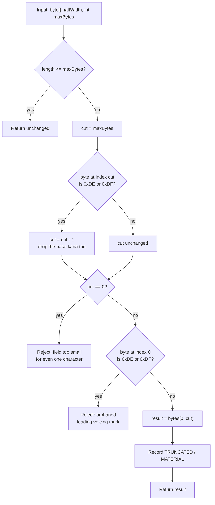
```mermaid
flowchart TD
    A["Input: byte[] halfWidth, int maxBytes"] --> B{"length <= maxBytes?"}
    B -->|yes| C["Return unchanged"]
    B -->|no| D["cut = maxBytes"]
    D --> E{"byte at index cut<br/>is 0xDE or 0xDF?"}
    E -->|yes| F["cut = cut - 1<br/>drop the base kana too"]
    E -->|no| G["cut unchanged"]
    F --> H{"cut == 0?"}
    G --> H
    H -->|yes| I["Reject: field too small<br/>for even one character"]
    H -->|no| J{"byte at index 0<br/>is 0xDE or 0xDF?"}
    J -->|yes| K["Reject: orphaned<br/>leading voicing mark"]
    J -->|no| L["result = bytes[0..cut)"]
    L --> M["Record TRUNCATED / MATERIAL"]
    M --> N["Return result"]
```

Reference implementation:

```java
static final int DAKUTEN      = 0xDE;   // ﾞ
static final int HANDAKUTEN   = 0xDF;   // ﾟ

static byte[] truncateSafe(byte[] in, int maxBytes, LossCollector loss) {
    if (in.length <= maxBytes) {
        return in;
    }

    int cut = maxBytes;
    // Never sever a base-kana / voicing-mark pair: dropping the mark
    // while keeping the base silently changes the character.
    if (isVoicingMark(in[cut])) {
        cut--;                              // drop the base character as well
    }
    if (cut <= 0) {
        throw new FieldTooSmallException(maxBytes);
    }
    if (isVoicingMark(in[0])) {
        throw new OrphanedVoicingMarkException();
    }

    byte[] out = Arrays.copyOf(in, cut);
    loss.record(LossEntry.truncated(decode(in), decode(out)));
    return out;
}

private static boolean isVoicingMark(byte b) {
    int u = b & 0xFF;
    return u == DAKUTEN || u == HANDAKUTEN;
}
```

### 16.4 Requirements

| # | Requirement |
|---|---|
| **R-K1** | Implement full-width → half-width katakana (`タ` → `ﾀ`) with voiced decomposition (`ガ` → `ｶ` + `ﾞ`, `パ` → `ﾊ` + `ﾟ`). |
| **R-K2** | Full-width Latin and digits → half-width, then uppercase. ~~Long vowel `ー` → `ｰ`. Small kana `ャ` → `ｬ`.~~ **Corrected in Epic 6 — see the note below.** Punctuation `、` `。` `「` `」` → half-width equivalents. |
| **R-K3** | **Truncation must be dakuten-aware** per §16.3. Never split a base/mark pair; never emit a leading orphaned mark. |
| **R-K4** | Truncation policy configurable: `REJECT_IF_TOO_LONG` (default), `TRUNCATE_SAFE` (always emits a `MATERIAL` loss entry), `TRUNCATE_WITH_MARKER`. |
| **R-K5** | Hiragana input: reject by default; optional conversion to katakana behind a flag, always with a `MATERIAL` loss entry. Never silent. |
| **R-K6** | **Kanji cannot be transliterated correctly** — readings are ambiguous. Reject with an error naming the offending characters. **Do not build a reading dictionary (P4).** |
| **R-K7** | Only certain base kana legally take a voicing mark: dakuten after `ｶ`–`ｺ`, `ｻ`–`ｿ`, `ﾀ`–`ﾄ`, `ﾊ`–`ﾎ`, `ｳ`; handakuten only after `ﾊ`–`ﾎ`. A mark following any other base is a `V-2xx` validation finding. |
| **R-K8** | Provide the inverse (half → full width) for display when mapping upward, marked `INFORMATIONAL` since it is not reliably reversible. |
| **R-K9** | Transliteration tables are a **data resource**, not code, covered by an exhaustive table-driven test. |

> **Correction, Epic 6 — R-K2's two named kana mappings are wrong.**
>
> `ｰ` (`0xB0`) and every small kana (`0xA7`–`0xAF`) are excluded from *every* field class by
> 全国銀行協会 付録1, as implemented in `CharacterClass` since Epic 3. A transliterator following
> R-K2 as written would emit text that this library's own validation rule `V-202` rejects.
>
> Implemented instead: `ー` → `-` and `ャ` → `ヤ`, each recorded as a `MATERIAL` loss. The
> reasoning, and the consequence that a long vowel has *no* legal form in a payroll name, are in
> [ADR-0028](docs/adr/0028-the-specifications-kana-mappings-are-wrong.md).
>
> This requirement predates the source research. Where a document written up front disagrees with
> evidence gathered later, the evidence wins — and the original wording is left above rather than
> quietly edited, because the ADR cites it.

> **Correction, Epic 6 — §16.3's reference implementation is asymmetric.**
>
> It checks for a leading orphaned voicing mark only on the truncating path, so a short input
> beginning with a stray mark passes and a long one does not. The input is equally damaged either
> way. `KanaTransliterator.truncateSafe` checks it before the length test.

## 17. Error and exception taxonomy

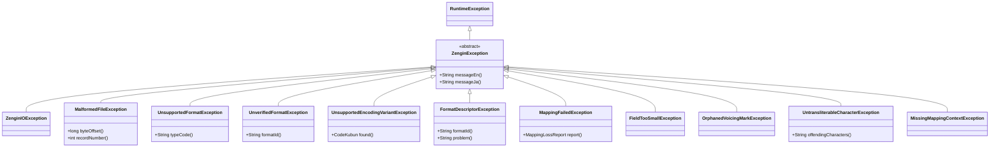
```mermaid
classDiagram
    class ZenginException {
        <<abstract>>
        +String messageEn()
        +String messageJa()
    }

    class ZenginIOException
    class MalformedFileException {
        +long byteOffset()
        +int recordNumber()
    }
    class UnsupportedFormatException {
        +String typeCode()
    }
    class UnverifiedFormatException {
        +String formatId()
    }
    class UnsupportedEncodingVariantException {
        +CodeKubun found()
    }
    class FormatDescriptorException {
        +String formatId()
        +String problem()
    }
    class MappingFailedException {
        +MappingLossReport report()
    }
    class FieldTooSmallException
    class OrphanedVoicingMarkException
    class UntransliterableCharacterException {
        +String offendingCharacters()
    }
    class MissingMappingContextException

    RuntimeException <|-- ZenginException
    ZenginException <|-- ZenginIOException
    ZenginException <|-- MalformedFileException
    ZenginException <|-- UnsupportedFormatException
    ZenginException <|-- UnverifiedFormatException
    ZenginException <|-- UnsupportedEncodingVariantException
    ZenginException <|-- FormatDescriptorException
    ZenginException <|-- MappingFailedException
    ZenginException <|-- FieldTooSmallException
    ZenginException <|-- OrphanedVoicingMarkException
    ZenginException <|-- UntransliterableCharacterException
    ZenginException <|-- MissingMappingContextException
```

| # | Requirement |
|---|---|
| **R-E1** | Exceptions signal programmer error and unrecoverable I/O only. Malformed input is **data**, surfaced as findings or `MalformedRecord`. |
| **R-E2** | No checked exceptions in the public API. All extend `ZenginException extends RuntimeException`. |
| **R-E3** | Every diagnostic states what was expected, what was found, exactly where (record number + byte offset + field), and how to fix it. |
| **R-E4** | All messages available in English and Japanese via `ResourceBundle`, defaulting to the JVM locale. Message text lives in properties files, never inline, so translation is reviewable. |
| **R-E5** | Never truncate diagnostic output silently — if 10,000 findings exist, report the count and provide paging. |
| **R-E6** | Diagnostics **mask account numbers to the last 4 digits by default**. Full values require explicit opt-in. |

## 18. Extension points (SPI)

Institutional practice varies. If the library cannot accommodate that, consumers will fork it.

| # | Requirement |
|---|---|
| **R-X1** | `FormatRegistry.register(FormatDescriptor)` accepts consumer-supplied descriptors at runtime, loaded from their own YAML. An institution-specific variant must not require a fork. |
| **R-X2** | `Rule` is a public interface; `ValidatorBuilder.withRules(...)` accepts custom rules. |
| **R-X3** | `BusinessCalendar` and `ReferenceDataProvider` are interfaces with `ServiceLoader` discovery. |
| **R-X4** | `MappingRule` is public; `MappingRegistry` accepts overrides so a consumer can redirect e.g. `EndToEndId` placement. |
| **R-X5** | Every SPI ships with at least one implementation **and** one worked custom example in `examples/`. An SPI with no worked example does not get used. |

---

# Part IV — Algorithms and worked example

## 19. Key algorithms

### 19.1 Record framing with optional separators

```java
int nextRecordOffset(byte[] buf, int pos, int recordLength) {
    int p = pos + recordLength;
    // Separators are not part of the record. Accept CRLF, CR, LF, or none —
    // possibly inconsistently within a single file.
    while (p < buf.length && (buf[p] == '\r' || buf[p] == '\n')) {
        p++;
    }
    return p;
}
```

### 19.2 Allocation-free numeric decode

```java
static long decodeNumeric(byte[] buf, int off, int len) {
    long v = 0;
    for (int i = off; i < off + len; i++) {
        int d = buf[i] - '0';
        if (d < 0 || d > 9) {
            throw new MalformedFieldException(i, buf[i]);
        }
        v = v * 10 + d;
    }
    return v;
}
```

No `String`, no `Integer.parseInt`, no boxing. The `N(12)` maximum of 999,999,999,999 sits well
inside `long`.

### 19.3 Trailer verification with overflow detection

```java
void verifyTrailer(Batch batch, Consumer<Finding> out) {
    long sum = 0;
    for (DataRecord d : batch.data()) {
        try {
            sum = Math.addExact(sum, d.amount());
        } catch (ArithmeticException e) {
            out.accept(Finding.overflow(batch, "V-303"));
            return;
        }
    }
    if (sum > 999_999_999_999L) {                 // N(12) capacity
        out.accept(Finding.exceedsTrailerCapacity(batch, sum, "V-304"));
    }
    if (sum != batch.trailer().totalAmount()) {
        out.accept(Finding.totalMismatch(batch, sum, "V-301"));
    }
    if (batch.data().size() != batch.trailer().recordCount()) {
        out.accept(Finding.countMismatch(batch, "V-302"));
    }
}
```

### 19.4 Year inference

```java
LocalDate forwardLooking(MonthDay md, LocalDate reference) {
    LocalDate candidate = safeAtYear(md, reference.getYear());
    return candidate.isBefore(reference)
        ? safeAtYear(md, reference.getYear() + 1)
        : candidate;
}

LocalDate nearest(MonthDay md, LocalDate reference) {
    return Stream.of(reference.getYear() - 1, reference.getYear(), reference.getYear() + 1)
        .map(y -> safeAtYear(md, y))
        .min(Comparator.comparingLong(d -> Math.abs(ChronoUnit.DAYS.between(reference, d))))
        .orElseThrow();
}
```

`safeAtYear` handles `0229` in a non-leap candidate year by reporting explicitly rather than throwing
a raw `DateTimeException` (R-D12).

> **Hazard to document:** a file produced on 28 December carrying value date `0105` means *next*
> January — `FORWARD_LOOKING` gets this right. A file produced on 5 January carrying `1228` means
> *previous* December — `FORWARD_LOOKING` gets this wrong and `NEAREST` gets it right. Neither
> strategy is universally correct. The API must make the choice explicit and unavoidable.

### 19.5 XML declaration boundary detection

```java
List<Integer> findDeclarationBoundaries(byte[] buf) {
    List<Integer> offsets = new ArrayList<>();
    byte[] needle = "<?xml".getBytes(StandardCharsets.US_ASCII);
    for (int i = 0; i <= buf.length - needle.length; i++) {
        if (matches(buf, i, needle)) {
            offsets.add(i);
        }
    }
    return offsets;
}
```

Provably safe against false positives inside a base64 EDI payload: the base64 alphabet is
`A–Z a–z 0–9 + / =`, which does not contain `<` (R-I8).

## 20. Worked example

### 20.1 A 総合振込 data record as bytes

A single payment: ¥150,000 to a beneficiary named ﾔﾏﾀﾞ ﾀﾛｳ, at institution `0009`, branch `123`,
ordinary account `7654321`, carrying customer reference `INV20260001`. All values synthetic.

```
Offset  Len  Field                Content (as text)
------  ---  -------------------  ---------------------------------
     0    1  データ区分            2
     1    4  被仕向銀行番号        0009
     5   15  被仕向銀行名          ﾃｽﾄｷﾞﾝｺｳ␣␣␣␣␣␣␣
    20    3  被仕向支店番号        123
    23   15  被仕向支店名          ﾃｽﾄｼﾃﾝ␣␣␣␣␣␣␣␣␣
    38    4  手形交換所番号        0000
    42    1  預金種目              1
    43    7  口座番号              7654321
    50   30  受取人名              ﾔﾏﾀﾞ␣ﾀﾛｳ␣␣␣␣␣␣␣␣␣␣␣␣␣␣␣␣␣␣␣␣
    80   10  振込金額              0000150000
    90    1  新規コード            0
    91   10  顧客コード1           INV2026000
   101   10  顧客コード2           1␣␣␣␣␣␣␣␣␣
   111    1  振込指定区分          7
   112    1  識別表示              ␣
   113    7  ダミー                ␣␣␣␣␣␣␣
------  ---
   120       total
```

Four things the library must handle and report, all visible in this one record:

1. **`ﾃｽﾄｷﾞﾝｺｳ` is 9 bytes for 7 apparent characters** — `ﾃ ｽ ﾄ ｷ ﾞ ﾝ ｺ ｳ` includes a standalone
   dakuten byte. This is why byte-length arithmetic is mandatory (R-C15).
2. **`ﾔﾏﾀﾞ` is 4 bytes for 3 apparent characters.** A 30-byte name field holds fewer characters than
   a naive character count suggests.
3. **The customer reference overflowed** — `INV20260001` is 11 bytes, spilling from 顧客コード1 into
   顧客コード2. Whether that spill is permitted is institution-specific (`[VERIFY]`); the library
   must at minimum emit a warning.
4. **Amounts are zero-padded to 10 digits, right-aligned; text fields are space-padded,
   left-aligned.** Two different padding rules in the same record.

### 20.2 The same payment as `pain.001` (abridged)

```xml
<CdtTrfTxInf>
  <PmtId>
    <EndToEndId>INV20260001</EndToEndId>
  </PmtId>
  <Amt>
    <InstdAmt Ccy="JPY">150000</InstdAmt>
  </Amt>
  <CdtrAgt>
    <FinInstnId>
      <ClrSysMmbId>
        <MmbId>0009123</MmbId>
      </ClrSysMmbId>
    </FinInstnId>
  </CdtrAgt>
  <Cdtr>
    <Nm>ヤマダ タロウ</Nm>
  </Cdtr>
  <CdtrAcct>
    <Id><Othr><Id>7654321</Id></Othr></Id>
    <Tp><Prtry>ORDINARY</Prtry></Tp>
  </CdtrAcct>
</CdtTrfTxInf>
```

### 20.3 The accompanying loss report (Zengin → ISO direction)

```json
{
  "entries": [
    { "kind": "TRANSLITERATED", "severity": "INFORMATIONAL",
      "sourcePath": "data[0].受取人名", "targetField": "Cdtr/Nm",
      "originalValue": "ﾔﾏﾀﾞ ﾀﾛｳ", "resultingValue": "ヤマダ タロウ",
      "explanationEn": "Half-width katakana widened for display. Not reliably reversible." },
    { "kind": "DROPPED", "severity": "INFORMATIONAL",
      "sourcePath": "data[0].新規コード", "targetField": null,
      "explanationEn": "No ISO 20022 equivalent for 新規コード." },
    { "kind": "DROPPED", "severity": "INFORMATIONAL",
      "sourcePath": "data[0].振込指定区分", "targetField": null,
      "explanationEn": "Delivery method indicator has no ISO 20022 equivalent." },
    { "kind": "DEFAULTED", "severity": "MATERIAL",
      "sourcePath": "header.振込指定日", "targetField": "PmtInf/ReqdExctnDt",
      "originalValue": "0930", "resultingValue": "2026-09-30",
      "explanationEn": "Year inferred from MappingContext reference date using FORWARD_LOOKING." }
  ]
}
```

Round-tripping back down adds a `TRUNCATED`/`MATERIAL` entry if the widened name no longer fits
30 bytes. That asymmetry is the demonstration that belongs in the README.

---

# Part V — Quality

## 21. Testing strategy

### 21.1 Formal invariants

State these as properties and test them with jqwik.

| # | Invariant |
|---|---|
| **INV-1** | For any valid file `f`: `write(read(f))` equals `f`, byte for byte. |
| **INV-2** | For any `ZenginFile` built via the builder: `read(write(file))` produces an equal `ZenginFile`. |
| **INV-3** | For any input bytes `b`, valid or not: `read(b)` terminates, allocates `O(1)` beyond the buffer, and either yields records or findings — never throws outside the declared exception hierarchy. |
| **INV-4** | For any string `s` and any `n ≥ 2`: `truncateSafe(toHalfWidth(s), n)` never ends with an orphaned voicing mark and never begins with one. |
| **INV-5** | For any file `f`: if `roundTrip(f).loss().isLossless()` then `roundTrip(f).output()` equals `f`. |
| **INV-6** | For any built file: `trailer.count == data.size()` and `trailer.total == Σ amounts`. |
| **INV-7** | Validation is deterministic and order-independent: the same file always produces the same finding set. |
| **INV-8** | For any format descriptor: `Σ field lengths == recordLength` for every record type. |

### 21.2 Test types

| # | Requirement |
|---|---|
| **R-T7** | **Property tests** (jqwik) covering INV-1 through INV-8. This is the load-bearing correctness guarantee. |
| **R-T8** | **Golden files** in `src/test/resources/conformance/` with expected parse results checked in as JSON. Any output change becomes a visible diff in review. |
| **R-T9** | **Fuzzing** (Jazzer) against the parser and the envelope splitter. No input may cause `OutOfMemoryError`, unbounded allocation, an infinite loop, or an undeclared exception. Corpus committed; nightly CI job. |
| **R-T10** | **Exhaustive transliteration table tests** — every character in the supported range with an asserted expected output, including all dakuten and handakuten combinations. |
| **R-T11** | **Adversarial truncation tests** targeting dakuten boundaries at every byte length from 1 to the field maximum, over a corpus of names chosen to place marks at every position. |
| **R-T12** | **Encoding matrix** — every fixture parsed under `SHIFT_JIS`, `MS932` and `UTF_8`, with expected outcomes (including expected failures) asserted for each. |
| **R-T13** | **Mapping tests** — for every mapping rule, a positive case and at least one loss-producing case, asserting the exact `LossEntry` produced. |
| **R-T14** | **XSD validation** of all generated XML in CI. |
| **R-T15** | **Mutation testing** (PIT) on `core` and `iso20022`, ≥ 80% mutation score. |
| **R-T16** | **Coverage** ≥ 90% line, ≥ 85% branch on `core`, enforced in CI. |
| **R-T17** | **Differential testing** against `Kyash/zengin-go` on the shared corpus where feasible; document every divergence in `docs/DISCREPANCIES.md`. |
| **R-T18** | **Windows CI is mandatory.** Line endings and default charsets differ materially. |

## 22. Performance design and budget

Target: **≥ 50 MB/s single-threaded parse**. At 120-byte records that is roughly 437,000 records/sec,
a budget of **~2.3 µs per record**.

| Stage | Budget | How it is met |
|---|---|---|
| I/O | amortised | Large buffered reads; buffer sized to a whole number of records |
| Framing | < 100 ns | Fixed-offset arithmetic; separator skip is a 2-byte check, not a scan |
| Discriminator dispatch | < 50 ns | Single byte read plus `switch` on a sealed hierarchy |
| Field decode | **0** unless accessed | Lazy `RecordView`; nothing decodes until the caller asks |
| Numeric decode | ~10 ns/field | Hand-written digit loop, no `String`, no boxing |
| String decode | ~50 ns/field | Only on access; cached within the view's lifetime |

| # | Requirement |
|---|---|
| **R-P1** | ≥ 50 MB/s single-threaded parse, measured by a committed JMH harness. |
| **R-P2** | Constant memory on the streaming path regardless of file size. Verified in CI against a generated 1 GB file under a constrained heap. |
| **R-P3** | Zero allocation per field in the hot path where the caller does not retain values. |
| **R-P4** | Benchmarks live in `benchmarks/` with the harness, exact hardware, JDK version and JVM flags recorded alongside results. **Any published number states its measurement conditions (P9).** |
| **R-P5** | If publishing latency distributions, use HdrHistogram and account for coordinated omission. |
| **R-P6** | CI performance regression gate with a generous threshold (fail at >20% regression) — catches real problems without becoming noise. |

## 23. Observability (Spring Boot starter, Epic 8)

| # | Requirement |
|---|---|
| **R-O1** | Micrometer metrics: `zengin4j.records.parsed`, `zengin4j.findings` tagged by severity and rule, `zengin4j.mapping.loss` tagged by kind and severity, `zengin4j.conversion.duration`. |
| **R-O2** | Actuator health indicator reporting reference-data snapshot age and calendar `validUntil()` proximity. |
| **R-O3** | Externalised configuration under `zengin4j.*`: charset, strict mode, suppressed rules, calendar source, truncation policy, `failOnSeverity`, `allowUnverifiedFormats`. |
| **R-O4** | Structured logging only in the starter, never in `core` (R-M1). |

---

# Part VI — Delivery

## 24. Build and release

| # | Requirement |
|---|---|
| **R-B1** | Gradle with Kotlin DSL and version catalogs. |
| **R-B2** | GitHub Actions matrix: JDK 21 and 25, on Linux, macOS and Windows. |
| **R-B3** | Group ID must be one the publisher controls. The placeholder `io.zengin4j` in §8 is to be replaced. |
| **R-B4** | Signed artifacts, sources jar, javadoc jar. |
| **R-B5** | Reproducible builds (`preserveFileTimestamps = false`, `reproducibleFileOrder = true`). |
| **R-B6** | CycloneDX SBOM attached to each release. |
| **R-B7** | Automated release on tag; `CHANGELOG.md` in Keep a Changelog format. |
| **R-B8** | Renovate or Dependabot enabled. |
| **R-B9** | OpenSSF Scorecard workflow. |
| **R-B10** | Semantic versioning, strictly. **Any change to parsed output for the same input bytes is a major version bump.** |
| **R-B11** | Publish `0.1.0` as soon as one format round-trips. Completeness is not a release gate. |

## 25. Documentation

| # | Requirement |
|---|---|
| **R-DOC1** | `README.md` and `README.ja.md`, kept in sync. Both must contain, in the first screen: what the library is, the BAH concatenation problem (§15.6), a quickstart, the conformance/experimental boundary, and the R-L6 disclaimer. |
| **R-DOC2** | Documentation site (MkDocs Material) on GitHub Pages, bilingual. |
| **R-DOC3** | Required pages: `formats/` (generated per format, with `verified` banner), `encoding.md`, `mapping.md` (generated, with per-row verification status), `loss.md`, `glossary.md`, `migration.md`, `SOURCES.md`, `DISCREPANCIES.md`, `OPEN_QUESTIONS.md`. |
| **R-DOC4** | `encoding.md` should be a complete English-language reference on half-width katakana handling in fixed-length payment files: byte ranges, dakuten decomposition, truncation hazards, CP932 divergence. |
| **R-DOC5** | Javadoc on every public type and method, with `@since`. `RecordView` carries the buffer-recycling warning (R-MEM2) in bold. |
| **R-DOC6** | `examples/` — one runnable program per use case in §4, plus one custom SPI implementation per R-X5. |
| **R-DOC7** | **ADRs in `docs/adr/`** for every significant decision and every interpretation call made during implementation (R-0.6). At minimum: format-shaped domain model, zero-dependency core, mandatory loss reporting, version pinning, lazy record views, dakuten-aware truncation, envelope splitting safety argument. |

## 26. Work breakdown

Ordered issues. Each references the requirements it satisfies.

### Epic 1 — Walking skeleton

| # | Issue | Requirements |
|---|---|---|
| 1.1 | Gradle multi-module skeleton, JPMS descriptors, CI on three OSes, ArchUnit dependency rules | R-M1–M7, R-B1–B2 |
| 1.2 | `FormatDescriptor` / `RecordDescriptor` / `FieldDescriptor` model + YAML loader with `verified` and `sources` | R-0.1, R-F1 |
| 1.3 | 総合振込 descriptor YAML, `verified: false` | R-0.3, §13.1 |
| 1.4 | Build-time field-length-sum validator | R-F1, INV-8 |
| 1.5 | Computed byte offsets from cumulative lengths | R-F2 |
| 1.6 | `RecordFramer` with separator handling | R-C6–C10 |
| 1.7 | `FieldCodec.decodeNumeric` / `decodeText` | R-MEM3, §19.2 |
| 1.8 | `StreamingZenginReader`, `RecordView`, parser state machine | R-MEM1–5, R-C1–C3 |
| 1.9 | `UnverifiedFormatException` and `allowUnverifiedFormats` option | R-0.1 |
| **M1** | **Milestone: parse a synthetic 総合振込 file end to end** | |

### Epic 2 — Writer and round-trip

| # | Issue | Requirements |
|---|---|---|
| 2.1 | `ZenginFileBuilder` with automatic trailer computation | R-C19, R-D6–D7 |
| 2.2 | `ZenginWriters` with deterministic output | R-C19 |
| 2.3 | jqwik generators for valid files | R-T7 |
| 2.4 | INV-1, INV-2, INV-6, INV-8 property tests | R-T7 |
| 2.5 | Golden-file corpus and harness | R-T8 |
| **M2** | **Milestone: INV-1 green** | |

### Epic 3 — Charset and the remaining 120-byte formats

| # | Issue | Requirements |
|---|---|---|
| 3.1 | `ZenginCharset` with `SHIFT_JIS` / `MS932` / `UTF_8` | R-C11–C13 |
| 3.2 | `CharacterSet.validate` returning violation offsets | R-C17 |
| 3.3 | EBCDIC detection with explicit failure | R-C14 |
| 3.4 | 給与振込 / 賞与振込 descriptors, `verified: false` | §13.1 |
| 3.5 | 預金口座振替 + 口座振替結果 descriptors; 振替結果コード open enum; direction-explicit naming | §13.1 |
| 3.6 | Encoding matrix tests | R-T12 |
| 3.7 | Jazzer fuzzing harness and committed corpus | R-T9 |
| 3.8 | JMH benchmarks; verify ≥ 50 MB/s; 1 GB constant-memory CI job | R-P1–P4 |
| **M3** | **Milestone: release `0.1.0`** | R-B11 |

### Epic 4 — Validation

| # | Issue | Requirements |
|---|---|---|
| 4.1 | `Finding` / `ValidationReport` / `Rule` / `RuleEngine` / `ValidationContext` | R-V1–V3 |
| 4.2 | Tier 1 structural rules | §14.3 |
| 4.3 | Tier 2 syntax rules including voicing-mark legality | §14.3, R-K7 |
| 4.4 | Tier 3 consistency rules including overflow detection | R-D7, §19.3 |
| 4.5 | `ReferenceDataProvider` + public-dataset implementation | R-V5 |
| 4.6 | `BusinessCalendar` + Japanese implementation with moving holidays and `validUntil()` | R-V6–V7 |
| 4.7 | JSON and SARIF serialisation | R-V4 |
| 4.8 | i18n message bundles, English and Japanese | R-E4 |
| 4.9 | Account-number masking in diagnostics | R-E6 |
| **M4** | **Milestone: release `0.2.0`** | |

### Epic 5 — CLI

| # | Issue | Requirements |
|---|---|---|
| 5.1 | Command skeleton and exit codes | §27 |
| 5.2 | `validate` with text / JSON / SARIF output | R-V4 |
| 5.3 | `inspect --annotate` byte-annotated hexdump | R-CLI5 |
| 5.4 | `generate --seed` deterministic synthetic fixtures | R-L1, R-T8 |
| 5.5 | `diff` and `explain` | |
| 5.6 | Shaded jar; optional GraalVM native image | |

> `inspect --annotate` is the primary diagnostic tool consumers will reach for. Invest in its output
> quality beyond what the feature list implies.

### Epic 6 — Transliteration engine

| # | Issue | Requirements |
|---|---|---|
| 6.1 | Kana tables as committed data resources | R-K9 |
| 6.2 | `toHalfWidth` with voiced decomposition | R-K1–K2 |
| 6.3 | `truncateSafe` per §16.3 | R-K3–K4 |
| 6.4 | Kanji rejection; hiragana policy | R-K5–K6 |
| 6.5 | `toFullWidth` inverse | R-K8 |
| 6.6 | Exhaustive table tests and adversarial truncation tests | R-T10–T11, INV-4 |
| 6.7 | `docs/encoding.md` | R-DOC4 |

### Epic 7 — ISO 20022 conformant subset

| # | Issue | Requirements |
|---|---|---|
| 7.1 | JAXB binding generation from XSDs | R-I21 |
| 7.2 | `ZediEnvelopeReader` / `ZediEnvelopeWriter` | R-I5–I9 |
| 7.3 | `head.001` BAH model | R-I5 |
| 7.4 | Loss model: `LossEntry`, `LossCollector`, `MappingLossReport` | R-I14–I16 |
| 7.5 | `MappingContext`, `MappingResult`, `RoundTripResult` | R-I20 |
| 7.6 | Mapping YAML + codegen, 総合振込 → `pain.001`, rows `verified: false` | R-I19 |
| 7.7 | Inverse `pain.001` → 総合振込 | R-I20 |
| 7.8 | `EdiAttachment` base64 handling with exact round-trip | R-I10–I13 |
| 7.9 | `dryRun` and `roundTrip` | R-I17–I18 |
| 7.10 | XSD validation in CI | R-T14 |
| 7.11 | Generated `mapping.md` with per-row verification status | R-I19 |
| **M5** | **Milestone: release `0.3.0`** | |

### Epic 8 — Extensions

Inbound `pain.002`, `camt.052`, `camt.054`; 口座振替 → `pain.008` in `experimental`; the 200-byte
formats; Spring Boot starter with metrics; static web playground; differential testing against
`zengin-go`.

## 27. CLI specification

```
zengin validate <file> [--format=ID] [--charset=...] [--suppress=V-207,V-401]
                       [--out-format=text|json|sarif] [--calendar=FILE]
                       [--allow-unverified]
zengin inspect  <file> [--record=N] [--annotate] [--unsafe-print]
zengin convert  <file> --to=pain.001 --context=ctx.yaml [--out=file.xml]
zengin convert  <file.xml> --to=zengin --context=ctx.yaml [--out=file.txt]
zengin dryrun   <file> --to=pain.001 --context=ctx.yaml
zengin generate --format=sougou-furikomi --count=100 --seed=42 --out=test.txt
zengin diff     <a> <b>
zengin explain  --format=sougou-furikomi [--field=beneficiaryName]
```

| # | Requirement |
|---|---|
| **R-CLI1** | Exit codes: `0` clean, `1` warnings only, `2` errors, `3` usage error, `4` I/O failure. |
| **R-CLI2** | `--out-format=json` available on every command. |
| **R-CLI3** | `generate --seed` is deterministic across platforms and JDK versions. |
| **R-CLI4** | Never print full record contents by default — payment data must not leak into CI logs. Require `--unsafe-print`. |
| **R-CLI5** | `inspect --annotate` prints, per field: byte offset, hex, decoded value, field name in both languages, and a validity marker. |
| **R-CLI6** | Using an unverified format requires `--allow-unverified` and prints a warning to stderr. |

## 28. Definition of Done

Per epic, all of the following must hold:

- [ ] All in-scope requirements implemented, each referenced by ID from at least one test
- [ ] Relevant invariants from §21.1 covered by property tests
- [ ] Fuzzing clean for 1 hour against the epic's parsers
- [ ] Coverage and mutation thresholds met (R-T15, R-T16)
- [ ] CI green on Linux, macOS **and Windows**
- [ ] Performance gate passed (R-P6)
- [ ] Generated documentation regenerated and committed
- [ ] `SOURCES.md` updated for anything newly derived
- [ ] `OPEN_QUESTIONS.md` updated for anything left unresolved
- [ ] An ADR written for every significant decision and every interpretation call
- [ ] `CHANGELOG.md` updated
- [ ] Javadoc complete on all new public API
- [ ] At least one `examples/` program exercising the new capability
- [ ] No format or mapping marked `verified: true` without ≥ 2 cited sources

## 29. Risks

| # | Risk | Impact | Mitigation |
|---|---|---|---|
| **R1** | Format details wrong because sources disagree or were unavailable | Silent financial incorrectness — the worst failure mode | The `verified` protocol (§0.3); multi-source confirmation; `DISCREPANCIES.md`; conservative defaults; visible banners in generated docs |
| **R2** | An implementer fills gaps with plausible invented data | Same as R1, but harder to detect | §0.2 and §0.4 P-rules; `verified: false` default; CI check that no descriptor is `verified: true` without sources |
| **R3** | Scope expands across format variants and the project never ships | No release | Hard epic milestones; `0.1.0` after a single format (R-B11) |
| **R4** | Round-trip fidelity broken by a well-intentioned "normalisation" | Data corruption | R-D5 (retain raw bytes); INV-1 as a blocking CI gate |
| **R5** | Lossy conversion treated as lossless by a consumer | Misrouted or misattributed payments | R-I14 — no API returns output without a loss report |
| **R6** | 2027 system replacement changes the formats | Rework | The corporate↔bank layer is the most stable part of the stack; the schema-driven design absorbs field changes cheaply |
| **R7** | Performance claim published without measurement | Credibility damage | P9, R-P4 |
| **R8** | Maintenance burden after initial delivery | Abandoned project | Tight scope, automated releases, an honest `MAINTENANCE.md` stating the support model |

## 30. Open questions

Record resolutions as ADRs. Add to `docs/OPEN_QUESTIONS.md` as new ones arise.

| # | Question | Recommendation |
|---|---|---|
| **Q1** | Project name — `zengin4j` vs alternatives | Check Maven Central and GitHub for collisions before committing to a coordinate |
| **Q2** | Where does `EndToEndId` go on the inverse leg? 顧客コード1 is 10 bytes against 35 available | Configurable via `EndToEndIdPolicy`, **defaulting to fail** rather than silently truncating |
| **Q3** | Bundle bank/branch reference data or require it be supplied? | Optional bundled module, **not** in `core`, with the snapshot date encoded in the artifact version |
| **Q4** | Hiragana input handling | Reject by default; conversion behind a flag with `MATERIAL` loss |
| **Q5** | Exact permitted symbol set for `C` fields | `[VERIFY]` — may vary by format; model as configurable per descriptor until confirmed |
| **Q6** | 振替結果コード list and per-institution variation | `[VERIFY]` — highest-value verification item; model as an open enum until confirmed |
| **Q7** | 200-byte format layouts | `[VERIFY]` — vary more between institutions; deferred to Epic 8 |
| **Q8** | ISO 20022 clearing system identifier for the domestic scheme | `[VERIFY]` — needed for `ClrSysMmbId`; leave the mapping row unverified until confirmed |
| **Q9** | 給与 / 賞与 field repurposing in data fields 12–14 | `[VERIFY]` — do not derive from 総合振込; confirm independently |
| **Q10** | Should `0.1.0` ship with `verified: false` formats at all? | Yes, gated behind `allowUnverifiedFormats`, with the limitation stated prominently in the README |

---

## Appendix A — Code lists

Believed values, to be confirmed in Epic 1 with sources cited. **Treat every `[VERIFY]` entry as
unknown until confirmed (§0.2).**

| Code list | Values |
|---|---|
| **データ区分** | `1` header, `2` data, `8` trailer, `9` end |
| **種別コード** | `11` 給与振込, `12` 賞与振込, `21` 総合振込, `91` 預金口座振替 |
| **コード区分** | `0` JIS, `1` EBCDIC |
| **預金種目** | `1` 普通 (ordinary), `2` 当座 (current), `4` 貯蓄 (savings) `[VERIFY]`, `9` その他 (other) |
| **新規コード** | `[VERIFY]` — believed `1` first transfer, `2` changed account details, `0` other |
| **振込指定区分** | `[VERIFY]` — believed `7` テレ為替, `8` 文書 |
| **振替結果コード** | `[VERIFY]` — `0` believed to indicate collected; non-zero values distinguish insufficient funds, account not found, account closed, customer stop instruction, other. Model as an open enum until confirmed. |

## Appendix B — Source categories for `SOURCES.md`

**Institutional / authoritative** — 全銀ネット (ZEDI connection guidance, XML format documentation,
system disclosures); 全銀協 (XML 形式 適用業務およびレコード・フォーマット); central bank ISO 20022
migration materials (useful context, `pacs`-focused).

**Institution-published format guides** — collect from at least three independent institutions per
format. Regional banks and 信用金庫 tend to publish the most complete documents.

**ISO 20022** — iso20022.org message catalogue and XSDs.

**Existing implementations** — `Kyash/zengin-go`, `diva-osaka/Diva.Zengin`, `zengin-code/*`.

Each entry records: institution, document title, URL, retrieval date, and which format definitions it
supports.

## Appendix C — Repository skeleton

```
zengin4j/
├── README.md  README.ja.md  LICENSE  NOTICE  CHANGELOG.md
├── CONTRIBUTING.md  CODE_OF_CONDUCT.md  SECURITY.md  DISCLAIMER.md  MAINTENANCE.md
├── settings.gradle.kts  build.gradle.kts  gradle/libs.versions.toml
├── docs/
│   ├── adr/                     # architecture decision records
│   ├── formats/                 # GENERATED — do not hand-edit
│   ├── encoding.md  mapping.md  loss.md  glossary.md  migration.md
│   ├── SOURCES.md  DISCREPANCIES.md  OPEN_QUESTIONS.md
│   └── ja/
├── zengin4j-core/
│   └── src/main/resources/formats/*.yaml
├── zengin4j-validation/
│   └── src/main/resources/calendar/*.json
├── zengin4j-iso20022/
│   ├── src/main/resources/mappings/*.yaml
│   └── src/main/resources/kana/*.tsv
├── zengin4j-testkit/
├── zengin4j-cli/
├── zengin4j-spring-boot-starter/
├── benchmarks/
├── examples/
└── .github/workflows/
```

## Appendix D — Diagram index

| § | Diagram | Type |
|---|---|---|
| 6 | Context and container view | flowchart |
| 7 | Module dependency graph | flowchart |
| 10 | Zero-copy memory model | flowchart |
| 11 | Domain model | classDiagram |
| 12.1 | Codec classes | classDiagram |
| 12.2 | Reading sequence | sequenceDiagram |
| 12.3 | Writing sequence | sequenceDiagram |
| 12.4 | Parser state machine | stateDiagram-v2 |
| 13 | Codegen pipeline | flowchart |
| 14.1 | Validation classes | classDiagram |
| 14.2 | Validation sequence | sequenceDiagram |
| 15.1 | Message families across the payment chain | flowchart |
| 15.3 | ISO 20022 classes | classDiagram |
| 15.4 | Zengin → pain.001 sequence | sequenceDiagram |
| 15.5 | pain.001 → Zengin sequence | sequenceDiagram |
| 15.6 | Envelope splitting | flowchart |
| 16.3 | Dakuten-safe truncation | flowchart |
| 17 | Exception taxonomy | classDiagram |

## Appendix E — Requirement index

Requirements are prefixed by area for cross-referencing from issues and tests:

| Prefix | Area | Section |
|---|---|---|
| `R-0.x` | Agent instructions | §0 |
| `R-L` | Repository policy | §5 |
| `R-M` | Modules and packaging | §7–8 |
| `R-T1`–`R-T6` | Threading | §9 |
| `R-MEM` | Memory model | §10 |
| `R-D` | Domain model | §11 |
| `R-C` | Codec | §12 |
| `R-F` | Format descriptors | §13 |
| `R-V` | Validation | §14 |
| `R-I` | ISO 20022 | §15 |
| `R-K` | Kana transliteration | §16 |
| `R-E` | Errors | §17 |
| `R-X` | Extension points | §18 |
| `R-T7`–`R-T18` | Testing | §21 |
| `R-P` | Performance | §22 |
| `R-O` | Observability | §23 |
| `R-B` | Build and release | §24 |
| `R-DOC` | Documentation | §25 |
| `R-CLI` | Command line | §27 |
| `P1`–`P10` | Prohibitions | §0.4 |
| `INV-1`–`INV-8` | Invariants | §21.1 |

---

*End of specification.*
